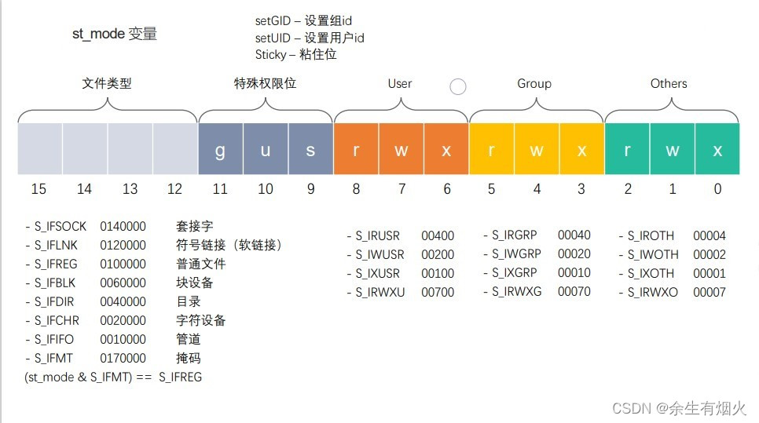
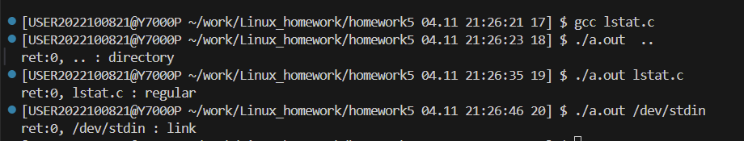
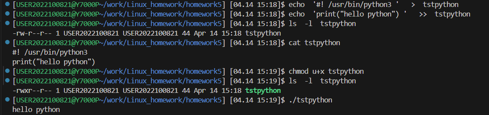
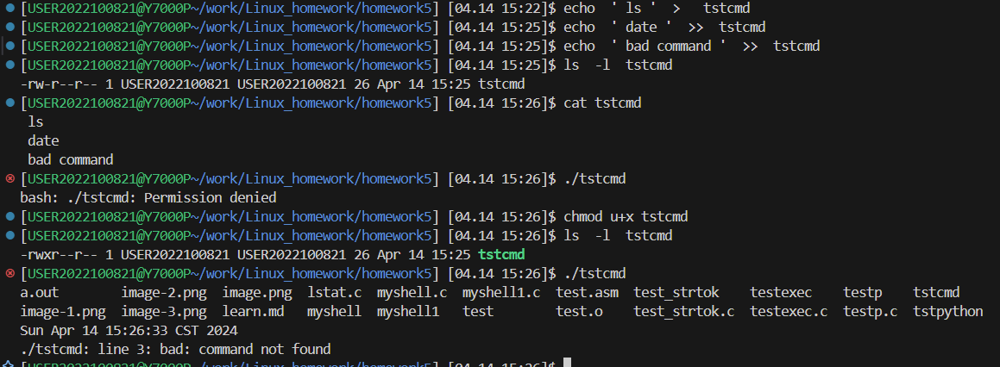
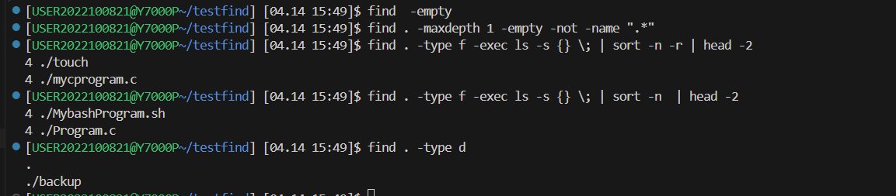
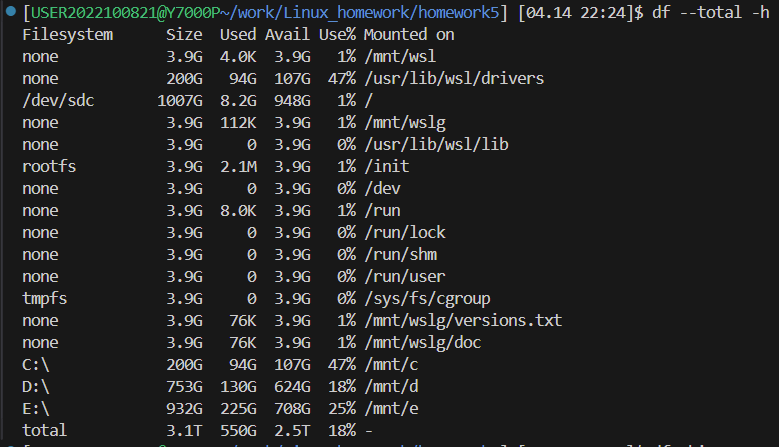

## git 
### 怎么查看当前文件夹是否属于git仓库
你可以在终端中使用 `git status` 命令来检查当前文件夹是否属于一个 Git 仓库。如果当前文件夹是一个 Git 仓库，这个命令会显示关于仓库状态的信息。如果当前文件夹不是一个 Git 仓库，这个命令会显示一个错误消息。

在终端中输入以下命令：

```bash
git status
```

如果你看到类似 "On branch master" 或 "No commits yet" 的消息，那么当前文件夹是一个 Git 仓库。如果你看到 "fatal: not a git repository (or any of the parent directories): .git" 的消息，那么当前文件夹不是一个 Git 仓库。
### 怎么提交修改
`git add .` 是一个 Git 命令，用于将当前目录下的所有更改添加到 Git 的暂存区。这包括新文件、已修改的文件和已删除的文件。这是准备提交更改的第一步。

在执行 `git add .` 命令后，你可以使用 `git commit` 命令来提交这些更改。例如：

```bash
git commit -m "Your commit message"
```

其中，"Your commit message" 是你的提交信息，应该简短地描述你所做的更改。
在你提交了更改之后，你可以使用 `git push` 命令将这些更改同步到你的 GitHub 仓库。这个命令会将你的本地仓库的更改推送到远程仓库。

如果你正在使用的分支是 `master`，你可以使用以下命令将更改推送到 GitHub：

```bash
git push origin master
```

这个命令的意思是将 `master` 分支的更改推送到 `origin`，其中 `origin` 通常是你的 GitHub 仓库的别名。

如果你正在使用的分支不是 `master`，你需要将 `master` 替换为你正在使用的分支的名称。例如，如果你正在使用的分支是 `dev`，你应该使用以下命令：

```bash
git push origin dev
```
### 什么是git分支
Git 分支是 Git 版本控制系统的一个重要特性，它允许你在同一份代码库中并行开发多个功能或修复多个问题。

在 Git 中，"分支" 是指向提交对象的可变引用。每次提交时，Git 都会创建一个新的提交对象并更新当前分支的引用，使其指向这个新的提交对象。这样，每个分支都代表了一个独立的开发历史。

你可以使用 `git branch` 命令来创建、列出、删除或重命名分支。你可以使用 `git checkout` 命令来切换到不同的分支。你可以使用 `git merge` 命令来合并两个分支的更改。

使用分支，你可以在不影响主开发线（通常是 `master` 分支）的情况下开发新功能或修复问题。当新功能开发完成或问题修复完成后，你可以将分支的更改合并回主开发线。
### git两台电脑同时用
如果你在两台电脑上都对同一个 GitHub 仓库进行了更改，并且想要保证这两台电脑上的更改都能同步到 GitHub 仓库，你可以按照以下步骤操作：

1. 在第一台电脑上，将你的更改提交到本地 Git 仓库，然后将这些更改推送到 GitHub。你可以使用以下命令：

```bash
git add .
git commit -m "Your commit message"
git push origin master
```

2. 在第二台电脑上，首先使用 `git pull` 命令将 GitHub 仓库的最新更改拉取到本地。这样，你就可以获取到第一台电脑上的更改。然后，将你在第二台电脑上的更改提交到本地 Git 仓库，并将这些更改推送到 GitHub。你可以使用以下命令：

```bash
git pull origin master
git add .
git commit -m "Your commit message"
git push origin master
```

这样，GitHub 仓库就会包含这两台电脑上的所有更改。

注意，如果两台电脑上的更改有冲突（即修改了同一个文件的同一部分），你需要在执行 `git pull` 命令后解决这些冲突，然后再提交和推送更改。


## markdown插入图片
可以直接复制图片插入markdown文档，但是会把图片复制到与该md文件同一目录，可以先批量把这些图片移动到img文件夹，再查找替换即可


在VS Code中，你可以使用"查找和替换"功能来批量修改文本。在你的情况下，你可以使用这个功能来批量修改图片的路径。

以下是如何使用"查找和替换"功能的步骤：

1. 打开你的Markdown文件。
2. 按`Ctrl+F`（在Mac上是`Command+F`）来打开"查找"框。
3. 在"查找"框中输入你想要替换的文本，例如`;
```

这个函数接收两个参数：一个是文件路径的字符串，另一个是一个`struct stat`类型的指针，这个结构体将被填充为文件的状态信息。

`struct stat`结构体包含了很多关于文件的信息，包括：

- `st_mode`：文件类型和权限
- `st_ino`：i节点号
- `st_dev`：设备ID
- `st_nlink`：硬链接数
- `st_uid`：所有者的用户ID
- `st_gid`：所有者的组ID
- `st_size`：文件的大小（字节）
- `st_atime`，`st_mtime`，`st_ctime`：文件的访问、修改和状态改变时间

`stat`函数成功时返回0，失败时返回-1，并设置`errno`为错误代码。

```c
#include <sys/types.h>
#include <sys/stat.h>
#include <unistd.h>
#include <stdio.h>
int main(){
    struct stat statbuf;
    int ret = stat("/home/USER2022100821/work/Linux_homework/homework5/test.asm",&statbuf);
    if(ret==-1){
        perror("stat");
        return -1;
    }
    printf("size:%ld\n",statbuf.st_size);
    return 0;
}
```

这段代码是用来获取指定文件（在这个例子中是`/home/USER2022100821/work/Linux_homework/homework5/test.asm`）的大小的。它使用了`stat`函数来获取文件的状态信息，然后打印出文件的大小。

下面是这段代码的详细解释：

1. 首先，定义了一个`struct stat`类型的变量`statbuf`，用来存储文件的状态信息。

2. 调用`stat`函数，第一个参数是要获取状态信息的文件的路径，第二个参数是`struct stat`类型的指针，指向要存储状态信息的结构体。

3. `stat`函数返回0表示成功，返回-1表示失败。如果`stat`函数失败，使用`perror`函数打印错误信息，并返回-1。

4. 如果`stat`函数成功，打印出文件的大小（`statbuf.st_size`）。

5. 最后，程序返回0，表示成功结束。

## 二、lstat创建软连接
`lstat`是一个Unix系统调用，用于获取文件的状态信息，类似于`stat`函数。但是，如果指定的文件是一个符号链接，`lstat`将返回符号链接本身的信息，而不是它所指向的文件的信息。

`lstat`函数的原型如下：

```c
#include <sys/types.h>
#include <sys/stat.h>
#include <unistd.h>

int lstat(const char *path, struct stat *buf);
```

这个函数接收两个参数：一个是文件路径的字符串，另一个是一个`struct stat`类型的指针，这个结构体将被填充为文件的状态信息。

`lstat`函数成功时返回0，失败时返回-1，并设置`errno`为错误代码。

如果你想获取符号链接所指向的文件的信息，你应该使用`stat`函数。如果你想获取符号链接本身的信息，你应该使用`lstat`函数。

lstat函数和stat函数有什么区别？

`lstat`函数和`stat`函数都是用于获取文件状态信息的系统调用，但是它们处理符号链接的方式不同。

- `stat`函数：当文件是一个符号链接时，`stat`会返回符号链接所指向的文件的信息，而不是符号链接本身的信息。

- `lstat`函数：当文件是一个符号链接时，`lstat`会返回符号链接本身的信息，而不是符号链接所指向的文件的信息。

所以，如果你想获取符号链接本身的信息，你应该使用`lstat`函数。如果你想获取符号链接所指向的文件的信息，你应该使用`stat`函数。

*****

假设我们有一个符号链接`link`，它指向一个文件`file`。我们可以使用`lstat`和`stat`函数来获取这两个文件的信息。

以下是一个C程序的示例，它使用`lstat`和`stat`函数来获取`link`和`file`的信息。

```c
#include <sys/types.h>
#include <sys/stat.h>
#include <unistd.h>
#include <stdio.h>

int main() {
    struct stat statbuf;
    struct stat lstatbuf;

    // 使用stat函数获取file的信息
    if (stat("file", &statbuf) == -1) {
        perror("stat");
        return -1;
    }

    // 使用lstat函数获取link的信息
    if (lstat("link", &lstatbuf) == -1) {
        perror("lstat");
        return -1;
    }

    printf("Size of file: %ld\n", statbuf.st_size);
    printf("Size of link: %ld\n", lstatbuf.st_size);

    return 0;
}
```

在这个程序中，我们首先使用`stat`函数获取`file`的信息，然后使用`lstat`函数获取`link`的信息。然后我们打印出`file`和`link`的大小。

注意，`link`的大小通常是它的目标文件名的长度，而不是目标文件的大小。这就是`lstat`和`stat`函数的主要区别。

符号链接（Symbolic Link），也被称为软链接，是一种特殊的文件类型，在Unix和Linux系统中常见。它是一个文件，包含了对另一个文件或目录的引用。

符号链接可以看作是一个指向另一个文件或目录的快捷方式。它包含的是目标文件或目录的路径，而不是文件的实际内容。因此，符号链接可以跨文件系统，可以链接到不存在的文件，也可以链接到目录。

创建符号链接的常用命令是`ln -s`，例如：

```bash
ln -s target_file symlink
```

这将创建一个名为`symlink`的符号链接，指向`target_file`。

使用`ls -l`命令，可以看到符号链接文件的详细信息，包括它指向的目标文件。例如：

```bash
ls -l symlink
```

输出可能如下：

```bash
lrwxrwxrwx 1 user group 12 Jan 1 00:00 symlink -> target_file
```

这表明`symlink`是一个符号链接，指向`target_file`。

## 三、文件权限
在Linux系统中，每个文件和目录都有一组权限。这些权限决定了哪些用户可以读取、写入或执行这个文件，或者进入这个目录。

文件权限分为三组，分别是：

- 文件所有者的权限
- 文件所属组的权限
- 其他用户的权限

每组权限包含三种类型：

- 读（r）：用户可以读取文件的内容，或者列出目录的内容。
- 写（w）：用户可以修改文件的内容，或者在目录中创建和删除文件。
- 执行（x）：用户可以执行文件，或者进入目录。

使用`ls -l`命令，可以看到文件的权限。例如：

```bash
-rwxr-xr-x 1 user group 123 Jan 1 00:00 file
```

这个输出表示：

- `-rwxr-xr-x`是文件的权限。第一个字符是文件类型（`-`表示普通文件，`d`表示目录，`l`表示符号链接）。接下来的三个字符是文件所有者的权限（`rwx`表示可读、可写、可执行）。接下来的三个字符是文件所属组的权限（`r-x`表示可读、可执行）。最后的三个字符是其他用户的权限（`r-x`表示可读、可执行）。
- `1`是文件的硬链接数。
- `user`是文件的所有者。
- `group`是文件的所属组。
- `123`是文件的大小（字节）。
- `Jan 1 00:00`是文件的最后修改时间。
- `file`是文件的名字。

是的，你可以使用`chmod`命令来修改文件或目录的权限。`chmod`命令可以接受数字（也称为八进制）或符号来表示权限。

每个权限可以用一个数字表示：

- 4代表读（r）
- 2代表写（w）
- 1代表执行（x）

这些数字可以相加。例如，如果你想设置一个文件的权限为可读、可写（但不可执行），你可以使用数字6（4+2）。

因为文件权限有三组（所有者、组、其他用户），所以你需要提供三个数字。例如，如果你想设置一个文件的权限为所有者可读写执行，组可读执行，其他用户可执行，你可以使用`chmod`命令如下：

```bash
chmod 754 file
```

这里，7（4+2+1）代表所有者的权限（可读、可写、可执行），5（4+1）代表组的权限（可读、可执行），4代表其他用户的权限（可读）。

注意，只有文件的所有者或超级用户（root）可以修改文件的权限。


****
在Linux系统中，文件权限是以位的形式存储的，每种权限（读、写、执行）都对应一个位。因此，我们可以使用位运算来检查用户是否具有某个权限。

例如，假设我们有一个权限值`chmod 754`，它可以转换为二进制形式`111 101 100`。这里，每个数字代表一组权限（所有者、组、其他用户），每个位代表一种权限（读、写、执行）。

如果我们想检查用户是否具有读权限，我们可以使用按位与运算（&）来比较用户的权限位和读权限位（4，或者二进制的`100`）。

以下是一个C程序的示例，它使用按位与运算来检查用户是否具有读权限：

```c
#include <sys/types.h>
#include <sys/stat.h>
#include <unistd.h>
#include <stdio.h>

int main() {
    struct stat statbuf;

    // 获取文件的权限
    if (stat("file", &statbuf) == -1) {
        perror("stat");
        return -1;
    }

    // 检查用户是否具有读权限
    if (statbuf.st_mode & S_IRUSR) {
        printf("User has read permission\n");
    } else {
        printf("User does not have read permission\n");
    }

    return 0;
}
```

在这个程序中，我们首先使用`stat`函数获取文件的权限，然后使用按位与运算来检查用户是否具有读权限。如果用户具有读权限，`statbuf.st_mode & S_IRUSR`的结果将不为0，否则结果将为0。


在Linux系统中，文件的权限被存储在一个叫做权限位（Permission Bits）的数据结构中。这个数据结构包含了一组标志位，每个标志位代表一种特定的权限。

权限位包括以下几种：

- 用户权限位（User Permission Bits）：这些位定义了文件所有者对文件的权限。
- 组权限位（Group Permission Bits）：这些位定义了文件所属组的成员对文件的权限。
- 其他权限位（Other Permission Bits）：这些位定义了其他所有用户对文件的权限。

每组权限位都包含三个位，分别代表读（r）、写（w）和执行（x）权限。例如，如果一个文件的用户权限位是110（二进制），那么文件所有者有读和写权限，但没有执行权限。
- 4代表读（r）100
- 2代表写（w）010
- 1代表执行（x）001
在C语言中，你可以使用`stat`函数获取一个文件的权限位，然后使用按位与运算（&）来检查特定的权限位是否被设置。例如，`S_IRUSR`是一个常量，代表用户读权限位。如果`statbuf.st_mode & S_IRUSR`的结果不为0，那么文件所有者具有读权限。

>这个权限位是不是三位二进制数，它的值代表着不同权限?
是的，你的理解是正确的。在Linux系统中，每组权限（用户、组、其他）都由三个权限位表示，每个权限位代表一种特定的权限：读（r）、写（w）和执行（x）。

这三个权限位可以用一个三位的二进制数表示，每个位的值（0或1）表示对应的权限是否被赋予。例如，权限位`110`（二进制）表示有读和写权限（但没有执行权限6=2+4,），因为第一位（读）和第二位（写）是1，第三位（执行）是0。

这三个权限位也可以用一个单独的八进制数或一个单独的十进制数表示。例如，八进制数`6`或十进制数`6`都表示有读和写权限（但没有执行权限），因为`6`（八进制）和`6`（十进制）都等于`110`（二进制）。

## 四、文件类型

在Linux系统中，有以下几种主要的文件类型：

- 普通文件（Regular file）：这是最常见的文件类型，可以包含任何数据。例如，文本文件、二进制文件、图片、视频等。

- 目录（Directory）：目录是包含其他文件和目录的文件。

- 符号链接（Symbolic link）：符号链接是一个特殊的文件，它是对另一个文件的引用。

- 设备文件（Device file）：设备文件是一种特殊的文件，用于表示系统中的设备。设备文件分为两种：字符设备文件和块设备文件。

- 套接字文件（Socket file）：套接字文件用于进程间通信。

- 管道文件（Pipe file）：管道文件也用于进程间通信，通常用于将一个进程的输出连接到另一个进程的输入。

- FIFO：FIFO是一种特殊类型的命名管道文件，用于进程间通信。

你可以使用`ls -l`命令查看文件的类型。在输出的第一个字符表示文件的类型：`-`表示普通文件，`d`表示目录，`l`表示符号链接，`c`表示字符设备文件，`b`表示块设备文件，`s`表示套接字文件，`p`表示管道文件。

对不起，我之前的解释有误。你是对的。在Linux系统中，文件的类型和权限信息被存储在一个16位的模式字段（mode field）中，这个模式字段是inode数据结构的一部分。

这个16位的模式字段可以被分为四部分：

- 前四位表示文件类型。例如，`1000`表示普通文件，`0100`表示目录，`0010`表示字符设备文件，`0001`表示块设备文件等。
- 接下来的三位表示特殊权限位，包括setuid、setgid和sticky位。
- 最后三组各三位表示文件的所有者（user）、组（group）和其他用户（other）的权限。每组三位中，第一位表示读权限，第二位表示写权限，第三位表示执行权限。

例如，如果一个文件的模式字段是`1000100110101010`，那么这个文件是一个普通文件（`1000`），有setuid和sticky位设置（`100`），所有者有读和写权限（`110`），组有读权限（`100`），其他用户有读和执行权限（`101`）。

你可以使用`stat`命令查看文件的模式字段。例如，`stat -c %a file`会显示文件的权限，`stat -c %F file`会显示文件的类型。

>什么是特殊权限
在Linux系统中，除了基本的读、写、执行权限外，还有一些特殊的权限，包括：

- Setuid（设置用户ID）：如果一个可执行文件设置了setuid位，那么无论谁运行这个文件，文件都会以文件所有者的身份运行。这对于需要高权限的程序（如passwd命令）非常有用。

- Setgid（设置组ID）：如果一个可执行文件设置了setgid位，那么无论谁运行这个文件，文件都会以文件所属组的身份运行。如果setgid位被设置在一个目录上，那么在该目录下创建的任何新文件都会继承该目录的组，而不是创建文件的用户的主组。

- Sticky位：如果一个目录设置了sticky位，那么只有文件的所有者、目录的所有者或root用户才能删除目录下的文件。这对于如/tmp目录非常有用，该目录可以被任何人写入，但只有文件所有者才能删除文件。

你可以使用`chmod`命令来设置这些特殊权限。例如，`chmod u+s file`会设置file的setuid位，`chmod g+s file`会设置file的setgid位，`chmod o+t directory`会设置directory的sticky位。

****

`stat -c %a test`命令的输出`755`表示`test`文件的权限设置。这个数字是一个八进制数，每个数字代表一组权限。

`755`可以分解为`7`（所有者权限）、`5`（组权限）和`5`（其他用户权限）。在八进制中，`7`等于二进制的`111`，表示所有者有读（4）、写（2）和执行（1）权限。`5`等于二进制的`101`，表示组和其他用户有读（4）和执行（1）权限，但没有写（2）权限。

所以，`755`的权限设置表示所有者有读、写和执行权限，而组和其他用户只有读和执行权限。


在Linux系统中，`stat`命令默认只显示文件权限的部分信息，即所有者、组和其他用户的读、写、执行权限。这是因为在日常使用中，我们最常关心的就是这些基本权限。

如果你想查看文件的完整权限信息，包括文件类型、特殊权限位等，你可以使用`stat -c %f 文件名`命令。这个命令会显示文件的完整模式字段，以十六进制的形式。

例如，如果`stat -c %f 文件名`命令的输出是`81a4`，那么你可以将这个十六进制数转换为二进制数，得到`1000000110100100`。这个二进制数的前四位`1000`表示文件是一个普通文件，接下来的三位`000`表示没有设置特殊权限位，最后的九位`011010010`表示所有者有读和执行权限，组有读权限，其他用户有读和执行权限。

请注意，`stat -c %f 文件名`命令显示的权限信息可能包含了一些额外的标志位，这些标志位在`stat -c %a 文件名`命令的输出中是看不到的。

`stat -c %f test`命令的输出`81ed`是一个十六进制数，表示文件`test`的完整权限信息。

我们可以将这个十六进制数`81ed`转换为二进制数，得到`1000000111101101`。

这个二进制数的前四位`1000`表示文件是一个普通文件，接下来的三位`000`表示没有设置特殊权限位，最后的九位`111101101`表示所有者有读、写和执行权限（`111`），组有读和执行权限（`101`），其他用户有读和执行权限（`101`）。

所以，`81ed`的权限设置表示文件`test`是一个普通文件，所有者有读、写和执行权限，而组和其他用户只有读和执行权限。
## 题目1

这是你在终端中运行`lstat.c`程序的输出。你使用`gcc`命令编译了`lstat.c`文件，然后运行了生成的可执行文件`a.out`，并给它传递了不同的文件路径参数。

- `./a.out  ..`：这个命令检查了当前目录的父目录`..`。输出`ret:0, .. : directory`表示`lstat`函数成功执行（返回值为0），并且`..`是一个目录。

- `./a.out lstat.c`：这个命令检查了`lstat.c`文件。输出`ret:0, lstat.c : regular`表示`lstat`函数成功执行（返回值为0），并且`lstat.c`是一个普通文件。

- `./a.out /dev/stdin`：这个命令检查了`/dev/stdin`文件。输出`ret:0, /dev/stdin : link`表示`lstat`函数成功执行（返回值为0），并且`/dev/stdin`是一个符号链接。在Linux系统中，`/dev/stdin`通常是一个指向当前进程的标准输入的符号链接。

# 进程
## 如何将程序变为进程。(exec 将程序上的代码及数据替换当前调用exec的进程)
是的，你的理解是正确的。`execve`是Linux系统中所有执行程序函数最底层的实现。它会替换当前进程的映像为新的程序文件，新的程序从其`main`函数开始执行。

`execve`函数的参数如下：

- `__path`：这是要执行的程序文件的完整路径。这个路径必须是绝对路径，`execve`函数不会在`PATH`环境变量指定的目录中查找程序文件。

- `__argv`：这是一个字符串数组，表示要传递给新程序的命令行参数。这个数组的第一个元素应该是程序的名称，最后一个元素必须是`NULL`。

- `__envp`：这是一个字符串数组，表示要设置的环境变量。每个字符串的格式为`name=value`，最后一个元素必须是`NULL`。

如果`execve`函数成功执行，它不会返回。如果函数返回，那么一定是发生了错误，错误码会保存在`errno`变量中。

以下是一个使用`execve`函数的简单示例。这个程序会执行`/bin/ls`命令，显示当前目录的内容。

```c
#include <stdio.h>
#include <unistd.h>

int main() {
    char *path = "/bin/ls";  // 要执行的程序的路径
    char *argv[] = { "ls", NULL };  // 命令行参数，第一个参数是程序的名称
    char *envp[] = { NULL };  // 环境变量，这里没有设置任何环境变量

    if (execve(path, argv, envp) == -1) {
        perror("execve");  // 如果execve函数返回，打印错误信息
    }

    return 0;
}
```


这个程序首先定义了要执行的程序的路径、命令行参数和环境变量。然后，它调用`execve`函数执行程序。如果`execve`函数返回，那么一定是发生了错误，程序会使用`perror`函数打印错误信息。

注意，`execve`函数会替换当前进程的映像，所以如果`execve`函数成功执行，`main`函数中`execve`函数后面的代码将不会被执行。

这个程序是一个简单的`execve`函数的使用示例。它接受一个命令行参数，该参数是要执行的程序的路径，然后使用`execve`函数执行该程序。

以下是带有注释的代码：

```c
#include <stdio.h>
#include <unistd.h>

extern char **__environ;  // 声明外部变量__environ，它是一个指向所有环境变量的指针

int main(int argc, char **argv)
{
    // 检查是否提供了要执行的程序的路径
    if (argc < 2)
    {
        fprintf(stderr, "Usage:%s <file to exec>\n", argv[0]);
        return -1;
    }

    char *cmdline[] = {"sh", NULL};  // 命令行参数，第一个参数是程序的名称

    // 调用execve函数执行程序，使用__environ作为环境变量
    execve(argv[1], cmdline, __environ);

    // 如果execve函数返回，打印错误信息
    perror("execve:");

    return 0;
}
```

这个程序首先检查是否提供了要执行的程序的路径。如果没有，它会打印使用说明并退出。然后，它调用`execve`函数执行程序，使用`__environ`作为环境变量。如果`execve`函数返回，那么一定是发生了错误，程序会使用`perror`函数打印错误信息。

编译后运行./a.out /usr/bin/gedit
你的程序将尝试使用`execve`函数执行`/usr/bin/gedit`。这将启动gedit编辑器。`execve`函数将替换当前进程的映像为gedit程序，所以如果`execve`函数成功执行，`main`函数中`execve`函数后面的代码将不会被执行。

如果`execve`函数执行失败（例如，`/usr/bin/gedit`不存在或者没有执行权限），那么`execve`函数会返回，并且`perror`函数会打印错误信息。

注意，你的程序将`sh`作为程序的名称传递给`execve`函数，这可能会导致一些问题，因为gedit可能会期望其程序名称是`gedit`。如果你想要正确地执行gedit，你应该将`cmdline`数组的第一个元素改为`gedit`。

## 题目2
这个程序主要用于测试`execve`函数的行为。它首先注册了一个信号处理函数，然后暂停等待信号。收到信号后，它会调用`execve`函数执行另一个程序。

以下是带有注释的代码：

```c
#include <stdio.h>
#include <unistd.h>
#include<signal.h>

void handler(int n)   // 自定义的信号处理函数，用于接收SIGUSR1信号
{
    printf("get signal  USR1， test exec continue \n");
}

int main(int argc,char *argv[])
{
    char *env_execve[]={"ONE=1","TWO=2", NULL};  // 要设置的环境变量
    char *argv_execve[]={"first","second", NULL};  // 要传递给新程序的命令行参数

    if (argc<2) {   // 检查是否提供了要执行的程序的路径
        printf("usage: testexec  prg \n");
        return(1);
    }

    signal(SIGUSR1,handler); // 注册SIGUSR1信号的处理函数

    printf("before exec,  pid:%d, ppid:%d, euid:%d\n", getpid(), getppid(), geteuid());  // 打印当前进程的信息

    pause();  // 暂停进程，等待信号

    // 调用execve函数执行程序
    if(execve(argv[1], argv_execve, env_execve)<0)
         perror("Err on execve");  // 如果execve函数返回，打印错误信息

    printf("after exec, pid:%d, ppid:%d, euid:%d\n", getpid(), getppid(), geteuid());  // 打印当前进程的信息

    return(0);
}
```

这个程序首先定义了要设置的环境变量和要传递给新程序的命令行参数。然后，它检查是否提供了要执行的程序的路径。如果没有，它会打印使用说明并退出。然后，它注册了SIGUSR1信号的处理函数，并打印当前进程的信息。接着，它暂停进程，等待信号。收到信号后，它会调用`execve`函数执行程序。如果`execve

## exec系列函数（execl、execlp、execle、execv、execvp）
`exec` 系列函数用于在当前进程中执行一个新的程序。这些函数会替换当前进程的映像、数据和堆栈等内容，然后执行新的程序。如果 `exec` 函数成功，它不会返回；如果失败，它会返回 -1，并设置 `errno` 为错误代码。

这些函数的主要区别在于如何指定要执行的程序和命令行参数：

- `execl` 和 `execv` 函数需要一个完整的路径来指定要执行的程序。例如，`execl("/bin/ls", "ls", "-l", NULL)` 会执行 `/bin/ls` 程序，并传递两个参数 "ls" 和 "-l"。
- `execlp` 和 `execvp` 函数会在 `PATH` 环境变量指定的目录中查找要执行的程序。例如，`execvp("ls", argv)` 会执行 `ls` 程序，并传递 `argv` 数组中的参数。
- `execl` 和 `execlp` 函数需要把命令行参数作为单独的参数传递。参数列表必须以 `NULL` 结束。例如，`execl("/bin/ls", "ls", "-l", NULL)`。
- `execv` 和 `execvp` 函数需要一个数组来传递命令行参数。这个数组必须以 `NULL` 结束。例如，`char *argv[] = {"ls", "-l", NULL}; execv("/bin/ls", argv)`。
- `execle` 函数和 `execl` 函数类似，但是它需要一个额外的环境变量数组。例如，`char *envp[] = {"PATH=/usr/bin", NULL}; execle("/bin/ls", "ls", "-l", NULL, envp)`。

这些函数都不会创建新的进程，如果你想在新的进程中执行程序，你需要先使用 `fork` 函数创建一个子进程，然后在子进程中调用 `exec` 函数。

>为什么要先fork再用这些函数
`fork` 和 `exec` 函数通常一起使用，因为它们各自的功能互补：

- `fork` 函数用于创建一个新的进程。这个新进程是当前进程的副本，它继承了父进程的代码、数据和环境变量等内容。但是，新进程有自己的进程 ID，它的某些资源（例如文件描述符和信号处理函数）可能和父进程不同。

- `exec` 函数用于在当前进程中执行一个新的程序。它会替换当前进程的代码、数据和环境变量等内容，然后执行新的程序。如果 `exec` 函数成功，它不会返回；如果失败，它会返回 -1，并设置 `errno` 为错误代码。

如果你直接在父进程中调用 `exec` 函数，那么父进程的代码、数据和环境变量等内容会被新的程序替换，父进程就无法继续执行了。这通常不是你想要的结果，因为父进程可能还需要做一些其他的工作，例如等待子进程结束，或者处理子进程的输出。

如果你先使用 `fork` 函数创建一个子进程，然后在子进程中调用 `exec` 函数，那么子进程的代码、数据和环境变量等内容会被新的程序替换，但是父进程的内容不会受到影响。这样，父进程就可以继续执行其他的工作，而子进程则执行新的程序。这是 Unix 和 Linux 系统中常见的编程模式。
*****
##  strtok() 函数
`strtok` 是 C 语言中的一个函数，用于将字符串分割成一系列的标记。它的原型如下：

```c
char *strtok(char *str, const char *delim);
```

- `str`：要分割的字符串。在第一次调用 `strtok` 时，你需要传递要分割的字符串。在后续的调用中，你应该传递 `NULL`，让 `strtok` 继续在上次的字符串上进行分割。
- `delim`：分隔符字符串。`strtok` 会使用这个字符串中的任何字符作为分隔符，将 `str` 分割成一系列的标记。

`strtok` 函数在找到一个标记后，会在标记的末尾添加一个 `\0` 字符，然后返回一个指向标记的指针。如果 `strtok` 找不到更多的标记，它会返回 `NULL`。

这是一个使用 `strtok` 的例子：

```c
#include <stdio.h>
#include <string.h>

int main() {
    char str[] = "Hello, World! Welcome to C programming.";
    char *token = strtok(str, " ,.-");

    while (token != NULL) {
        printf("%s\n", token);
        token = strtok(NULL, " ,.-");
    }

    return 0;
}
```

这个程序会将 `str` 分割成一系列的单词，并打印出来。

这行代码是使用 `strtok` 函数来分割字符串的。`strtok` 函数接受两个参数：

- 第一个参数 `str` 是要分割的字符串。
- 第二个参数 `" ,.-"` 是分隔符字符串，`strtok` 函数会使用这个字符串中的任何字符作为分隔符。

`strtok` 函数会找到 `str` 中的第一个标记，然后返回一个指向这个标记的指针。如果 `str` 中没有标记，`strtok` 函数会返回 `NULL`。

在这个例子中，`strtok` 函数会找到 `str` 中由空格、逗号、点或短横线分隔的第一个标记，并将 `token` 指针设置为这个标记的开始位置。

注意，`strtok` 函数会修改它的第一个参数，将找到的标记后的第一个字符替换为 `\0`。如果你需要保留原始字符串，你应该在调用 `strtok` 函数之前复制这个字符串。

是的，`token` 指针被设置为标记的开始位置。在这段代码中，`strtok` 函数被用来分割字符串 `str`。分隔符是空格、逗号、点和短横线。

在第一次调用 `strtok` 函数时，它会在 `str` 中查找第一个分隔符，并将其替换为 `\0`，然后返回一个指向 `str` 开始位置的指针。这个指针被赋值给 `token`，所以 `token` 指向的是第一个标记的开始位置。

然后，`while` 循环开始执行。在每次迭代中，`strtok` 函数都会在 `str` 中查找下一个分隔符，并将其替换为 `\0`，然后返回一个指向这个标记的指针。这个指针再次被赋值给 `token`，所以 `token` 指向的是当前标记的开始位置。

当 `strtok` 函数找不到更多的标记时，它会返回 `NULL`，`while` 循环就会结束。

`strtok` 函数在第一次调用时，第一个参数应该是你想要分割的字符串。然后，`strtok` 会在这个字符串中查找分隔符，并返回第一个标记。

在后续的调用中，你应该将第一个参数设置为 `NULL`，这告诉 `strtok` 函数在同一个字符串上继续查找新的标记。`strtok` 函数内部会记住上次在哪里停止，然后从那里开始查找新的标记。

所以，`token = strtok(NULL, " ,.-");` 这行代码是在获取下一个标记。如果没有更多的标记，`strtok` 函数会返回 `NULL`。

>为什么到最后token就等于NULL
`strtok` 函数在找不到更多的标记时会返回 `NULL`。这是因为 `strtok` 函数在每次调用时都会在字符串中查找下一个分隔符。如果找不到更多的分隔符，那么就没有更多的标记可以返回，所以 `strtok` 函数会返回 `NULL`。

在你的代码中，`token = strtok(NULL, " ,.-");` 这行代码会在每次循环迭代时调用，试图获取下一个标记。当 `strtok` 函数返回 `NULL` 时，这个 `NULL` 值会被赋值给 `token`，然后 `while (token != NULL)` 循环条件就不再满足，所以循环会结束。

所以，当你看到 `token` 等于 `NULL` 时，这意味着 `strtok` 函数已经找不到更多的标记，字符串已经被完全分割完毕。

>token是指针吗
是的，`token` 是一个指针。在 C 语言中，字符串通常表示为字符指针，指向字符串的第一个字符。

在你的代码中，`char *token = strtok(str, " ,.-!");` 这行代码声明了一个名为 `token` 的字符指针，并将其初始化为 `strtok` 函数返回的值。`strtok` 函数返回的是在 `str` 中找到的第一个标记的指针。

然后，在 `while` 循环中，`token` 被更新为指向下一个标记，或者当没有更多标记时，被设置为 `NULL`。
# 文件权限
你使用 `chmod u+x tstcmd` 命令给 `tstcmd` 文件添加了执行权限。`chmod` 是一个 Unix 和 Linux 系统中用来改变文件或目录权限的命令，`u+x` 表示给文件的所有者添加执行权限。

# 解释器程序


你输入的 `#! /usr/bin/python3` 是一个 shebang，它在 Unix-like 系统中用于指定执行脚本的解释器。在这个例子中，它指定了 Python 3 解释器的路径，这意味着这个脚本应该使用 Python 3 来执行。如果你在文件的开头添加了这行代码，然后给文件添加了执行权限，你就可以直接运行这个文件，而不需要先输入 `python3` 命令。例如，如果你的文件名是 `script.py`，你可以使用 `./script.py` 来运行这个文件，而不需要使用 `python3 script.py`。
## 什么是shebang
Shebang（也被称为 hashbang 或 pound-bang）是一个由井号（#）和感叹号（!）组成的两字符序列，它出现在文本脚本的第一行的开头。在 Unix-like 系统中，shebang 用于指定执行脚本的解释器。

例如，如果你有一个 Python 脚本，你可以在脚本的第一行写入 `#!/usr/bin/python3`。这个 shebang 告诉系统应该使用 `/usr/bin/python3` 这个 Python 解释器来执行这个脚本。

同样，如果你有一个 Bash 脚本，你可以在脚本的第一行写入 `#!/bin/bash`。这个 shebang 告诉系统应该使用 `/bin/bash` 这个 Bash 解释器来执行这个脚本。

使用 shebang 的好处是，你可以直接运行脚本，而不需要先输入解释器的名称。例如，如果你的脚本名为 `script.py` 并且你已经给它添加了执行权限，你可以直接输入 `./script.py` 来运行这个脚本，而不需要输入 `python3 script.py`。

## 文件x属性

你创建了一个名为 `tstcmd` 的文件，并在其中添加了几个命令：

1. `ls`：列出当前目录的内容。
2. `date`：显示当前的日期和时间。
3. `bad command`：这不是一个有效的命令，所以在执行时会报错。

然后，你尝试直接执行 `tstcmd` 文件，但是因为它没有执行权限，所以你收到了 "Permission denied" 的错误消息。

接着，你使用 `chmod u+x tstcmd` 命令给 `tstcmd` 文件添加了执行权限。

最后，你再次尝试执行 `tstcmd` 文件，这次成功了。`ls` 和 `date` 命令成功执行，但是 `bad command` 命令因为不是一个有效的命令，所以报错了。

要注意的是，尽管 `tstcmd` 文件现在有了执行权限，但是它并不是一个有效的 shell 脚本，因为它没有 shebang。如果你想让它成为一个 shell 脚本，你需要在文件的开头添加一个 shebang，例如 `#!/bin/bash`。

虽然 `tstcmd` 文件没有 shebang，但是当你尝试执行它时，shell 会尝试使用默认的 shell（在大多数 Linux 系统中是 `/bin/sh` 或 `/bin/bash`）来执行它。

在你的 `tstcmd` 文件中，`ls` 和 `date` 都是有效的 shell 命令，所以它们被成功执行了。然而，`bad command` 不是一个有效的命令，所以在尝试执行它时报错了。

如果你在文件的开头添加了一个 shebang，例如 `#!/bin/bash`，那么无论你的默认 shell 是什么，shell 都会使用 shebang 指定的解释器来执行这个文件。这可以确保你的脚本在不同的系统和环境中都能按照你的预期来执行。


>/bin/sh 或 /bin/bash里的sh是什么bash是什么

`/bin/sh` 和 `/bin/bash` 都是 shell 的类型，它们是用户与操作系统进行交互的接口。

`/bin/sh` 是 Bourne shell 的路径。Bourne shell 是 Unix 系统原始的 shell，由 Stephen Bourne 在 Bell Labs 开发。它提供了基本的命令行功能，但是不支持一些现代 shell 的高级特性。

`/bin/bash` 是 Bourne Again shell 的路径。Bourne Again shell 是 Bourne shell 的替代品，由 GNU 项目开发。它包含了 Bourne shell 的所有特性，并添加了许多新的特性，如命令行编辑、命令历史和命令别名等。

在很多现代的 Linux 系统中，`/bin/sh` 实际上是指向 `/bin/bash` 或其他兼容 Bourne shell 的 shell（如 Dash）的符号链接。

# find
`find` 是一个在 Linux 和 Unix-like 系统中用于搜索文件的强大命令。以下是一些常见的 `find` 命令的用法：

1. 在当前目录中查找名为 `file.txt` 的文件：
   ```bash
   find . -name file.txt
   ```

2. 在 `/home` 目录中查找名为 `file.txt` 的文件：
   ```bash
   find /home -name file.txt
   ```

3. 在当前目录中查找所有的 `.txt` 文件：
   ```bash
   find . -name "*.txt"
   ```

4. 在当前目录中查找所有的目录：
   ```bash
   find . -type d
   ```

5. 在当前目录中查找所有的普通文件：
   ```bash
   find . -type f
   ```

6. 在当前目录中查找最近 7 天内被修改过的文件：
   ```bash
   find . -mtime -7
   ```

7. 在当前目录中查找超过 100KB 的文件：
   ```bash
   find . -size +100k
   ```

8. 在当前目录中查找并删除所有的 `.txt` 文件：
   ```bash
   find . -name "*.txt" -delete
   ```

9. 在当前目录中查找所有的 `.png` 文件，并将它们移动到 `images` 目录：
   ```bash
   find . -name "*.png" -exec mv {} images \;
   ```

10. 在当前目录中查找所有的 `.jpg` 文件，并使用 `convert` 命令将它们转换为 `.png` 文件：
    ```bash
    find . -name "*.jpg" -exec convert {} {}.png \;
    ```

这只是 `find` 命令的一部分用法，`find` 命令的功能非常强大，可以进行更多的操作和更复杂的搜索。

`find test*` 和 `find . -name 'test*'` 的主要区别在于它们处理通配符的方式和搜索的范围。

1. `find test*`：在这个命令中，`test*` 是由 shell 扩展的。这意味着 shell 会首先找到当前目录下所有以 `test` 开头的文件和目录，然后再将这些文件和目录作为 `find` 命令的参数。这个命令只会在以 `test` 开头的文件和目录中进行搜索。

2. `find . -name 'test*'`：在这个命令中，`'test*'` 是由 `find` 命令处理的。这意味着 `find` 命令会在当前目录及其所有子目录中查找所有以 `test` 开头的文件和目录。

因此，如果你的目标是在当前目录及其所有子目录中查找所有以 `test` 开头的文件和目录，你应该使用 `find . -name 'test*'`。如果你只想在当前目录中的以 `test` 开头的文件和目录中进行搜索，你可以使用 `find test*`。

`find` 命令的输出结果中的 `./` 是表示当前目录的路径。在这个上下文中，它表示 `find` 命令在当前目录（`.`）中找到了匹配的文件。

例如，`./test` 表示在当前目录中找到了一个名为 `test` 的文件或目录。

这是 `find` 命令的默认行为，它会显示找到的文件或目录的相对路径，而不是绝对路径。如果你想让 `find` 命令显示绝对路径，你可以使用绝对路径作为 `find` 命令的起始目录，例如 `find /home/user -name 'test*'`。

## 作业题6
```bash
cd  ~
mkdir testfind
cd testfind
vi  create_sample_files.sh  
# 输入以下内容（红色字体部分）
echo “ file 1”  >  MybashProgram.sh
echo “ file 2 file 2” >  mycprogram.c
echo “ file 3 file 3 file 3 ”  > touch MyCProgram.c
echo “file 4 file 4 file 4 file 4”  >  Program.c

mkdir backup
cp  ./*  ./backup
# 输入内容结束 

chmod +x create_sample_files.sh
./create_sample_files.sh
ls -R
find -name "MyCProgram.c"
find -iname "MyCProgram.c"
sudo  find / -name passwd
sudo find  / -maxdepth 2 -name passwd
sudo find  / -maxdepth 3 -name passwd
sudo find  /  -mindepth 3 -maxdepth 5 -name passwd
find  -empty
find . -maxdepth 1 -empty -not -name ".*"
find . -type f -exec ls -s {} \; | sort -n -r | head -2
find . -type f -exec ls -s {} \; | sort -n  | head -2
find . -type d
```

你的命令执行了以下操作：

1. 切换到 home 目录，创建一个名为 `testfind` 的新目录，并切换到这个新目录。
2. 创建一个名为 `create_sample_files.sh` 的新文件，并在其中添加了一些命令来创建更多的文件。
3. 创建一个名为 `backup` 的新目录，并将 `testfind` 目录中的所有文件复制到 `backup` 目录。
4. 使 `create_sample_files.sh` 文件可执行，并执行它。
5. 使用 `ls -R` 命令列出 `testfind` 目录及其所有子目录中的所有文件。
6. 使用 `find` 命令查找名为 `MyCProgram.c` 的文件。`-name` 选项是区分大小写的，所以这个命令只会找到完全匹配 `MyCProgram.c` 的文件。
7. 使用 `find` 命令查找名为 `MyCProgram.c` 的文件。`-iname` 选项不区分大小写，所以这个命令会找到所有匹配 `MyCProgram.c`（不论大小写）的文件。
8. 使用 `sudo find` 命令在整个文件系统中查找名为 `passwd` 的文件。
9. 使用 `sudo find` 命令在文件系统的前两层中查找名为 `passwd` 的文件。
10. 使用 `sudo find` 命令在文件系统的第三层到第五层中查找名为 `passwd` 的文件。
11. 使用 `find` 命令查找所有的空文件和目录。
12. 使用 `find` 命令查找当前目录中的所有空文件，但不包括以 `.` 开头的隐藏文件。
13. 使用 `find` 命令查找所有的文件，并使用 `ls -s` 命令列出它们的大小。然后，这些文件被按大小排序，并显示最大的两个文件。
14. 使用 `find` 命令查找所有的文件，并使用 `ls -s` 命令列出它们的大小。然后，这些文件被按大小排序，并显示最小的两个文件。
15. 使用 `find` 命令查找所有的目录。


你的命令 `sudo find / -mindepth 3 -maxdepth 5 -name passwd` 在文件系统的第三层到第五层中查找名为 `passwd` 的文件。

这里的参数解释如下：

- `sudo`：使用超级用户权限运行命令，这通常是查找整个文件系统所必需的。
- `find`：Linux 系统中的文件查找命令。
- `/`：查找的起始目录，这里是文件系统的根目录。
- `-mindepth 3`：设置查找的最小深度为 3，这意味着 `find` 命令会忽略根目录和其直接子目录，从第三层开始查找。
- `-maxdepth 5`：设置查找的最大深度为 5，这意味着 `find` 命令会在达到第五层后停止深入查找。
- `-name passwd`：只查找名为 `passwd` 的文件。

这个命令会返回所有在文件系统的第三层到第五层中找到的名为 `passwd` 的文件的路径。


你的命令 `find . -maxdepth 1 -empty -not -name ".*"` 在当前目录（不包括子目录）中查找所有的空文件和目录，但不包括以 `.` 开头的隐藏文件和目录。

这里的参数解释如下：

- `find`：Linux 系统中的文件查找命令。
- `.`：查找的起始目录，这里是当前目录。
- `-maxdepth 1`：设置查找的最大深度为 1，这意味着 `find` 命令只在当前目录中查找，不会进入任何子目录。
- `-empty`：这是一个选项，它告诉 `find` 命令只查找空的文件和目录。
- `-not -name ".*"`：这是一个条件，它告诉 `find` 命令忽略所有以 `.` 开头的文件和目录。在 Linux 中，以 `.` 开头的文件和目录是隐藏的。

这个命令会返回所有在当前目录中找到的空文件和目录的路径，但不包括隐藏文件和目录。如果没有找到任何符合条件的文件或目录，那么这个命令不会有任何输出。


你的命令 `find . -type f -exec ls -s {} \; | sort -n -r | head -2` 在当前目录及其所有子目录中查找所有的文件，并列出它们的大小。然后，这些文件被按大小排序，并显示最大的两个文件。

这里的参数解释如下：

- `find`：Linux 系统中的文件查找命令。
- `.`：查找的起始目录，这里是当前目录。
- `-type f`：这是一个条件，它告诉 `find` 命令只查找文件，不包括目录。
- `-exec ls -s {} \;`：这是一个动作，它告诉 `find` 命令对每个找到的文件执行 `ls -s` 命令。`ls -s` 命令会列出文件的大小。`{}` 是一个占位符，它在执行时会被替换为当前找到的文件的路径。
- `| sort -n -r`：这是一个管道操作，它将 `find` 命令的输出传递给 `sort` 命令。`sort -n -r` 命令会按数值大小进行排序，并反转结果，使得最大的数值在最前面。
- `| head -2`：这是另一个管道操作，它将 `sort` 命令的输出传递给 `head` 命令。`head -2` 命令会显示前两行。

这个命令会返回当前目录及其所有子目录中最大的两个文件的大小和路径。如果没有找到任何文件，那么这个命令不会有任何输出。

你的命令 `find . -type f -exec ls -s {} \; | sort -n -r | head -2` 在当前目录及其所有子目录中查找所有的文件，并列出它们的大小。然后，这些文件被按大小排序，并显示最大的两个文件。

这里的参数解释如下：

- `find`：Linux 系统中的文件查找命令。
- `.`：查找的起始目录，这里是当前目录。
- `-type f`：这是一个条件，它告诉 `find` 命令只查找文件，不包括目录。
- `-exec ls -s {} \;`：这是一个动作，它告诉 `find` 命令对每个找到的文件执行 `ls -s` 命令。`ls -s` 命令会列出文件的大小。`{}` 是一个占位符，它在执行时会被替换为当前找到的文件的路径。
- `| sort -n -r`：这是一个管道操作，它将 `find` 命令的输出传递给 `sort` 命令。`sort -n -r` 命令会按数值大小进行排序，并反转结果，使得最大的数值在最前面。
- `| head -2`：这是另一个管道操作，它将 `sort` 命令的输出传递给 `head` 命令。`head -2` 命令会显示前两行。

这个命令会返回当前目录及其所有子目录中最大的两个文件的大小和路径。如果没有找到任何文件，那么这个命令不会有任何输出。

# df
`df` 是一个在 Unix 和类 Unix 系统（如 Linux）中用来报告文件系统磁盘空间使用情况的命令。它的名字来源于 "disk filesystem"。

基本用法：
```bash
df
```
这个命令会显示所有已挂载文件系统的磁盘空间使用情况。

如果你想查看特定文件或目录所在的文件系统的磁盘空间使用情况，你可以将文件或目录的路径作为参数传递给 `df` 命令，例如：
```bash
df /home
```

`df` 命令有很多选项可以用来改变它的输出。以下是一些常用的选项：

- `-h` 或 `--human-readable`：以人类可读的格式（例如 KB、MB、GB）显示磁盘空间使用情况，而不是以字节为单位。例如：
  ```bash
  df -h
  ```

- `-a` 或 `--all`：显示所有文件系统的磁盘空间使用情况，包括通常不显示的文件系统（如系统特殊目的的文件系统）。例如：
  ```bash
  df -a
  ```

- `-T` 或 `--print-type`：在输出中包含每个文件系统的类型。例如：
  ```bash
  df -T
  ```

- `-i` 或 `--inodes`：显示 inode 使用情况，而不是磁盘空间使用情况。在 Unix 和类 Unix 系统中，每个文件和目录都有一个 inode，包含了文件的元数据（如权限、所有者、大小等）。例如：
  ```bash
  df -i
  ```

- `-x` 或 `--exclude-type`：不显示指定类型的文件系统。例如，如果你不想显示 tmpfs 文件系统，你可以使用：
  ```bash
  df -x tmpfs
  ```

- `-t` 或 `--total`：在输出的最后一行添加一个总计行，显示所有文件系统的磁盘空间使用总和。例如：
  ```bash
  df -t
  ```

以上就是 `df` 命令的一些基本用法和选项。你可以使用 `man df` 命令来查看 `df` 命令的完整文档，获取更多的信息和选项。



这是 `df -h` 命令的输出，它显示了你的系统中所有已挂载文件系统的磁盘空间使用情况。每一行代表一个文件系统，每一列的含义如下：

- `Filesystem`：文件系统的名称。
- `Size`：文件系统的总大小。
- `Used`：已经被使用的磁盘空间。
- `Avail`：可用的磁盘空间。
- `Use%`：已经被使用的磁盘空间的百分比。
- `Mounted on`：文件系统的挂载点，也就是在你的系统中，你可以通过哪个路径来访问这个文件系统。

例如，第一行的输出 `none 3.9G 4.0K 3.9G 1% /mnt/wsl` 表示 `/mnt/wsl` 这个挂载点的文件系统总大小为3.9G，已使用4.0K，剩余可用空间为3.9G，使用率为1%。

最后三行显示了你的 C、D、E 盘的磁盘空间使用情况。例如，`C:\ 200G 94G 107G 47% /mnt/c` 表示你的 C 盘总大小为200G，已使用94G，剩余可用空间为107G，使用率为47%。在你的 Linux 系统中，你可以通过 `/mnt/c` 这个路径来访问你的 C 盘。


GitHub Copilot
rootfs 是 Linux 系统中的一个特殊文件系统，它是内核在启动过程中创建的一个临时的、内存中的文件系统。rootfs 的主要作用是提供一个最初的根文件系统，供内核在启动过程中使用。

在系统启动完成后，rootfs 通常会被实际的根文件系统（例如 /dev/sda1 或其他设备上的文件系统）替换。然而，在某些情况下，例如在使用了某些类型的容器技术的情况下，rootfs 可能会继续存在。

在 df 命令的输出中，如果你看到 rootfs，那么它表示的就是这个临时的根文件系统。它的大小、已使用的空间、可用的空间等信息，通常会反映内存的使用情况，而不是硬盘的使用情况。

wangtust
tmpfs

GitHub Copilot
tmpfs 是一种在 Linux 和 Unix 系统中常见的临时文件系统，它将文件存储在内存中，而不是在硬盘上。因为内存的读写速度远高于硬盘，所以 tmpfs 非常适合存储需要频繁读写的临时文件。

tmpfs 的一个重要特性是，它的内容在系统重启后会消失。这使得它成为存储临时文件的理想选择，因为这些文件在系统重启后通常不再需要。

在 df 命令的输出中，如果你看到 tmpfs，那么它表示的就是一个 tmpfs 文件系统。它的大小、已使用的空间、可用的空间等信息，通常会反映内存的使用情况，而不是硬盘的使用情况。

例如，你可能会在 /run、/sys/fs/cgroup 等目录下看到 tmpfs 文件系统，这些目录通常用于存储系统运行时的临时文件。

`tmpfs` 是一个临时文件系统，它的内容主要是系统运行时的临时文件。这些文件通常包括：

- 进程间通信的数据：例如，套接字文件、命名管道文件等。
- 系统运行状态的信息：例如，`/proc` 和 `/sys` 目录下的文件。
- 用户和应用程序的临时文件：例如，`/tmp` 目录下的文件。

请注意，`tmpfs` 的内容存储在内存中，所以在系统重启后，这些内容会被清除。

`/dev/sdc` 是一个设备文件，用于访问系统中的第三个 SCSI 或 SATA 硬盘。它的内容主要是硬盘上的数据，具体取决于你如何使用这个硬盘。例如，你可能在这个硬盘上安装了一个操作系统，或者用它来存储文件。

`/dev/sdc` 的英文全称并不是一个固定的词组，但我们可以将其分解为以下部分：

- `/dev`：Device，设备的意思，表示这是一个设备文件。
- `sd`：SCSI Disk，SCSI 硬盘的意思，表示这是一个 SCSI 或 SATA 硬盘。
- `c`：表示这是第三个硬盘，因为 `a` 表示第一个，`b` 表示第二个，以此类推。

所以，`/dev/sdc` 可以理解为 "the third SCSI or SATA disk device"，即 "第三个 SCSI 或 SATA 硬盘设备"。

`/dev/sdc` 是一个设备文件，代表你的系统中的第三个 SCSI 或 SATA 硬盘。具体它包含什么内容，取决于你如何使用这块硬盘。以下是一些可能的例子：

1. 如果你在 `/dev/sdc` 这块硬盘上安装了一个 Linux 系统，那么它可能包含了 Linux 的各种系统文件，如内核文件、系统库、应用程序等。

2. 如果你将 `/dev/sdc` 用作数据存储，那么它可能包含了你的个人文件，如文档、图片、音乐等。

3. 如果你在 `/dev/sdc` 上运行了一个数据库，那么它可能包含了数据库的数据文件。

4. 如果这块硬盘是新的或者已经被格式化，那么 `/dev/sdc` 可能是空的。

请注意，`/dev/sdc` 本身只是一个设备文件，用于访问硬盘。真正的数据是存储在硬盘上的。你可以使用各种命令（如 `ls`, `cd`, `cp`, `rm` 等）或者文件管理器来查看和操作硬盘上的文件。

在 Linux 系统中，`/mnt` 是一个用于挂载文件系统的目录，其名称来自 "mount" 这个词，意为 "挂载"。

所以，`/mnt/wsl` 的 `mnt` 部分的英文全称是 "mount"。整个路径 `/mnt/wsl` 的意思是 "the mount point for WSL (Windows Subsystem for Linux)"，即 "用于挂载 WSL 的挂载点"。

在 Linux 和 Unix 系统中，挂载点是文件系统结构中的一个位置，它允许你将设备（如硬盘、光盘、USB 驱动器等）或者其他文件系统（如网络共享）的内容接入到你的系统中。

当一个设备或文件系统被挂载到一个挂载点时，你可以通过访问这个挂载点来访问设备或文件系统的内容。这就像在你的文件系统中打开了一个窗口，让你可以看到和操作设备或文件系统的内容。

例如，如果你有一个 USB 驱动器，并且你将它挂载到 `/mnt/usb` 这个目录，那么你就可以通过访问 `/mnt/usb` 来查看和操作 USB 驱动器中的文件。

请注意，挂载点必须是一个已经存在的目录，你可以使用任何你喜欢的目录作为挂载点。在设备或文件系统被挂载之前，挂载点目录是空的，或者包含的文件将在挂载后被隐藏。

`rootfs` 是 "root filesystem" 的缩写，中文翻译为 "根文件系统"。它是 Linux 系统启动过程中的一个临时文件系统，由内核在内存中创建。

`rootfs` 的内容主要包括：

- Linux 内核需要的最基本的文件和目录，例如 `/dev`、`/proc`、`/sys` 等。
- 用于启动系统的基本命令和工具，例如 `init`、`bash` 等。

在系统启动完成后，`rootfs` 通常会被实际的根文件系统（例如 `/dev/sda1` 或其他设备上的文件系统）替换。然而，在某些情况下，例如在使用了某些类型的容器技术的情况下，`rootfs` 可能会继续存在。

在 Linux 系统中，`none` 通常在一些系统命令的输出中表示没有关联的设备或者文件系统。具体的含义可能会根据上下文的不同而有所不同。以下是一些可能的情况：

1. 在 `mount` 命令的输出中，如果一个挂载点的设备名是 `none`，那么可能表示这个挂载点是一个虚拟文件系统，如 `proc`、`sysfs`、`tmpfs` 等，这些文件系统并没有关联的物理设备。

2. 在 `/etc/fstab` 文件中，`none` 可能用于指定虚拟设备，如 `swap`。

3. 在 `df` 命令的输出中，如果一个文件系统的设备名是 `none`，那么可能表示这个文件系统是在内存中创建的，如 `tmpfs`。

总的来说，`none` 通常表示没有关联的物理设备。

在你提供的 `df -hi` 命令的输出中，`none` 出现在 "Filesystem" 列，表示这些挂载点并没有关联的物理设备。这些挂载点通常是虚拟文件系统或者内存中的文件系统。

例如，`/mnt/wsl`、`/mnt/wslg`、`/usr/lib/wsl/drivers`、`/usr/lib/wsl/lib`、`/init`、`/dev`、`/run`、`/run/lock`、`/run/shm`、`/run/user`、`/sys/fs/cgroup`、`/mnt/wslg/versions.txt` 和 `/mnt/wslg/doc` 这些挂载点都是 `none`，表示它们可能是虚拟文件系统（如 `procfs`、`sysfs`）或者内存中的文件系统（如 `tmpfs`）。

这些文件系统虽然没有关联的物理设备，但它们在系统运行中起着重要的作用。例如，`/dev` 提供了访问设备的接口，`/run` 存储了运行时的系统信息，`/sys/fs/cgroup` 用于控制和监视进程等。

`df` 是 "disk filesystem" 的缩写，中文翻译为 "磁盘文件系统"。它是一个常用的 Unix 和 Linux 命令，用于显示磁盘空间的使用情况。

# Git
- 工作区（Workspace）：这是你在电脑上看到的目录，比如你在本地创建了一个名为 `my_project` 的目录，这个目录就是你的工作区。

- 暂存区（Index / Stage）：当你在工作区修改了文件后，你可以选择将这些修改添加到暂存区。暂存区是 Git 的一个概念，它是一个中间区域，用于临时保存你的改动。你可以把它想象成一个缓存区域，用于临时保存你的改动，直到你决定提交这些改动到仓库。

- 仓库区（Repository）：当你确定你的改动没有问题后，你可以将暂存区的改动提交到仓库。这样，你的改动就被永久保存下来了。仓库区是保存了所有提交（commit）历史的地方，你可以在这里查看、比较和恢复历史版本。

- 远程仓库（Remote）：远程仓库通常存储在网络上，比如 GitHub、GitLab 等。你可以将本地仓库的改动推送（push）到远程仓库，也可以从远程仓库拉取（pull）其他人的改动。这样，多个人就可以协作在同一个项目上工作了。