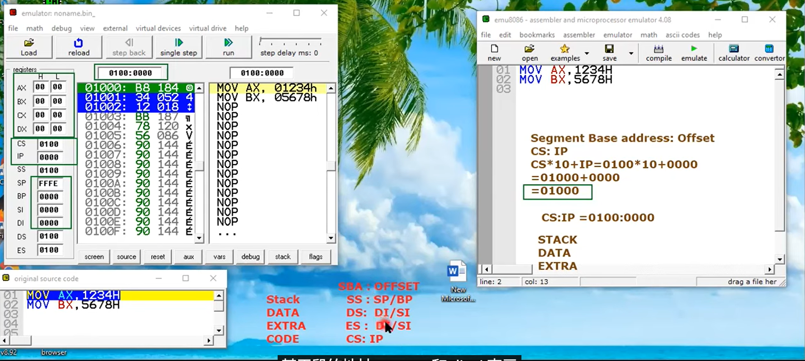
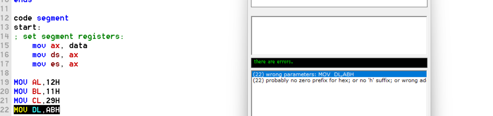
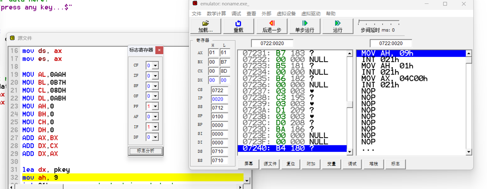
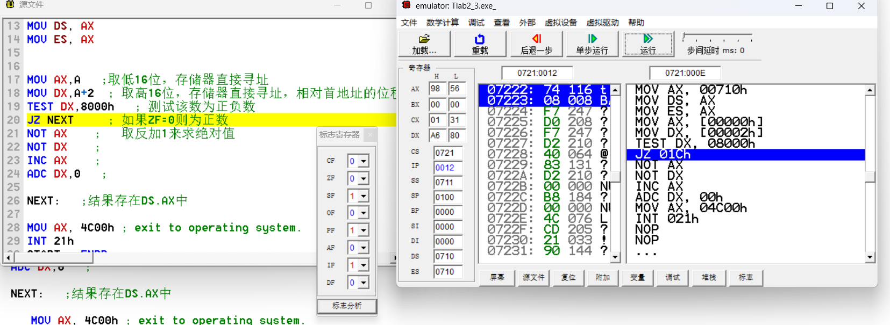
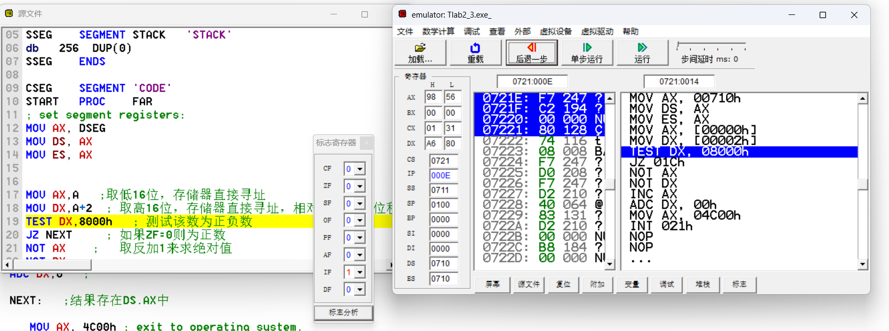

## 怎么删除流氓软件无法删除的文件？
同时按CTRL键SHIFT键ESC键，打开WINDOWS任务管理器，选进程，找到EXPLORER.EXE，点击结束进程，再点左角上面的文件，再点新建任务（运行），再点右下角的浏览，再找要删除后面带DLL等无法删除的文件，删除后再恢复EXPLORER.EXE的进程，也可直接断最重启，桌面上的快捷图标重新出现。
## 汇编寄存器

## 指令报错

在 x86 汇编语言中，`MOV DL, ABH` 这条指令是无效的，因为 `ABH` 不是一个有效的寄存器或者立即数值。

在 8086 汇编语言中，`MOV` 指令用于将一个值从源操作数复制到目标操作数。源操作数和目标操作数可以是寄存器或者内存地址，但是在这个例子中，`ABH` 并不是一个有效的寄存器名或者立即数值。

如果你想要将一个立即数值（例如十六进制数 `AB`）移动到 `DL` 寄存器，你应该使用以下的指令：

```assembly
MOV DL, 0ABH
```

如果你想要将一个寄存器（例如 `AH`）的值移动到 `DL` 寄存器，你应该使用以下的指令：

```assembly
MOV DL, AH
```

请检查你的代码，确保你使用的是正确的寄存器名或者立即数值。
## 8086FLAGS寄存器

8086 微处理器的 FLAGS 寄存器是一个 16 位寄存器，其中包含了一些状态标志。以下是这些标志的英文全称和它们的含义：

1. CF（Carry Flag，进位标志）：当最后一次算术操作产生了进位或者借位时，这个标志被设置。

2. PF（Parity Flag，奇偶标志）：在最后一次算术或逻辑操作的结果中，如果 1 的个数是偶数，这个标志被设置。

3. AF（Auxiliary Carry Flag，辅助进位标志）：在算术操作的低四位产生进位或借位时，这个标志被设置。

4. ZF（Zero Flag，零标志）：当最后一次算术或逻辑操作的结果为零时，这个标志被设置。

5. SF（Sign Flag，符号标志）：在最后一次算术或逻辑操作的结果中，如果最高位（符号位）是 1，这个标志被设置。

6. TF（Trap Flag，陷阱标志）：当这个标志被设置时，CPU 会在每次执行完一条指令后产生一个中断，通常用于调试。

7. IF（Interrupt Enable Flag，中断允许标志）：当这个标志被设置时，CPU 允许响应外部中断。

8. DF（Direction Flag，方向标志）：这个标志用于控制字符串操作指令的处理方向。

9. OF（Overflow Flag，溢出标志）：当最后一次有符号数的算术操作产生溢出时，这个标志被设置。

请注意，FLAGS 寄存器的其他位在 8086 微处理器中是未定义的。在后来的 x86 微处理器中，这些位被用于其他的标志和模式。
## 双长字取绝对值



DSEG    SEGMENT 'DATA'
      A DW 9856H,0A680H
DSEG    ENDS

SSEG    SEGMENT STACK   'STACK'
      db   256  DUP(0)
SSEG    ENDS

CSEG    SEGMENT 'CODE'
   START   PROC    FAR
      ; set segment registers:
      MOV AX, DSEG
      MOV DS, AX
      MOV ES, AX


   MOV AX,A   ;取低16位，存储器直接寻址
   MOV DX,A+2  ; 取高16位，存储器直接寻址，相对首地址的位移量为2
   TEST DX,8000h   ; 测试该数为正负数
   JZ NEXT     ; 如果ZF=0则为正数
   NOT AX    ;   取反加1来求绝对值 
   NOT DX    ;
   INC AX    ;
   ADC DX,0   ;  
   
   NEXT:   ;结果存在DS.AX中
   
      MOV AX, 4C00h ; exit to operating system.
      INT 21h    
   START   ENDP
CSEG    ENDS
END    START    ; set entry point.


在 x86 汇编语言中，`TEST` 是一个逻辑 AND 操作，它将两个操作数进行 AND 操作，但并不保存结果，只改变标志寄存器的状态。

`TEST DX, 8000h` 这条指令将 `DX` 寄存器的值和 `8000h`（十六进制数，等于二进制的 1000 0000 0000 0000）进行 AND 操作。这实际上是检查 `DX` 寄存器的最高位（符号位）是否被设置。如果最高位被设置，那么 `DX` 寄存器的值和 `8000h` 的 AND 结果不为零，否则结果为零。

这条指令常常和条件跳转指令一起使用，例如 `JZ`（如果零标志被设置则跳转）或 `JNZ`（如果零标志未被设置则跳转），用于根据 `DX` 寄存器的符号位决定程序的控制流。

在 x86 汇编语言中，`INC AX` 和 `ADC DX,0` 这两条指令用于实现二进制补码运算，以求得负数的绝对值。

`INC AX` 这条指令将 `AX` 寄存器的值加 1。这是二进制补码运算的一部分，用于将一个负数转换为其绝对值。

`ADC DX,0` 这条指令将 `DX` 寄存器的值和 0 进行加法运算，并加上前一条指令可能产生的进位。`ADC` 是 "Add with Carry" 的缩写，意思是 "加上进位"。如果 `INC AX` 这条指令产生了进位，那么 `ADC DX,0` 这条指令就会将 `DX` 寄存器的值加 1。

总的来说，这两条指令一起用于实现二进制补码运算，将一个负的双字长数转换为其绝对值。

类似的JNS
在 x86 汇编语言中，`JNS` 是一个条件跳转指令，全称是 "Jump if Not Sign"，意思是 "如果符号位未被设置则跳转"。

`JNS NoNeg` 这条指令检查前一条指令的结果是否为正数。如果是正数，那么符号位（Sign Flag）未被设置，程序的控制流就会跳转到 `NoNeg` 标签标记的位置继续执行。如果是负数，那么符号位被设置，程序会继续顺序执行下一条指令。

在你提供的代码片段中，`JNS NoNeg` 用于判断前一条指令的结果是否为正数，如果是正数，那么就跳过一段代码，直接跳转到 `NoNeg` 标签处继续执行。
## 压缩BCD码
在 x86 汇编语言中，`SHL` 是一个位移指令，全称是 "Shift Left"，意思是 "向左位移"。

`SHL` 指令将指定的寄存器或内存位置的值向左移动指定的位数。向左移动一位等同于将数值乘以 2。例如，`SHL AX, 1` 将 `AX` 寄存器的值向左移动一位，等同于将 `AX` 寄存器的值乘以 2。

在这个上下文中，`SHL` 用于快速地乘以 2 的幂。注意，向左移动可能会导致最高位的值丢失，同时会在最低位填充 0。