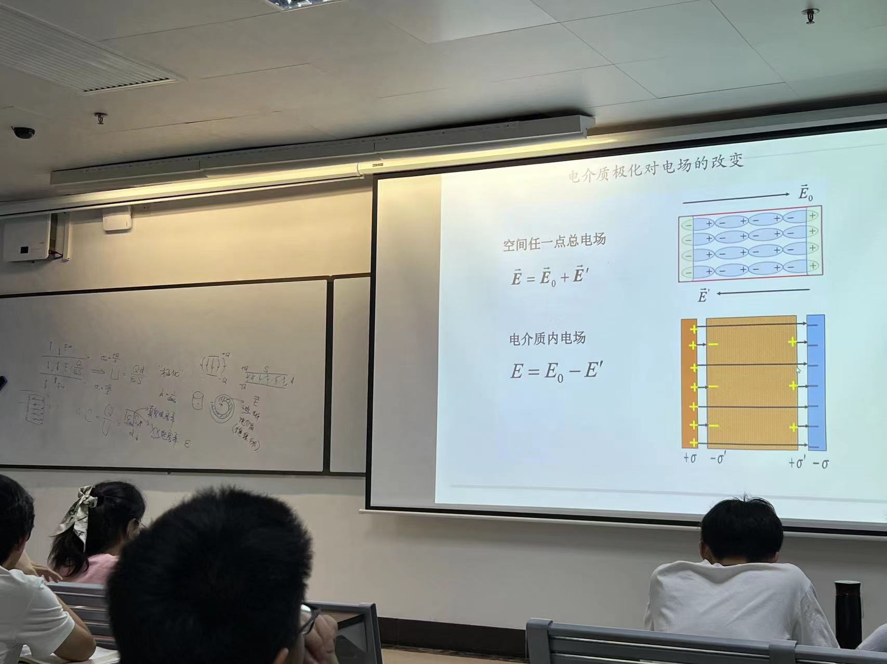

# 大学物理第六章
带电小球接地，欧拉定理

涉及电荷密度，曲率半径，曲率半径分之一

带点球壳套带电金属球

带电金属面的电场计算

电容器
球带电，无穷远看为负极

平行板电容器

注意两板的上下产生的电场抵消了

电路板上圆柱电容内部结构

中间空的地方是油或者纸，绝缘体，等电解质，改变电容，相对于空气，电容增大，因为更不容易击穿

极化
无电偶极矩分子，如甲烷，放到电场，他的正负电荷中心会偏移，形成电偶极矩

两个带电圆柱面的电容算法
注意“相对电容率”

电容并联相当于面积变大
串联相当于d1+d2

电容器充电做功

做功的微元
假设中间时刻，电极板上已经有了q电荷，然后再移动dq的电荷做功

再研究这个冲完电的电容器所带能量和电场的关系

先将能量里的C和Q用E代替，V代表S*d,是体积