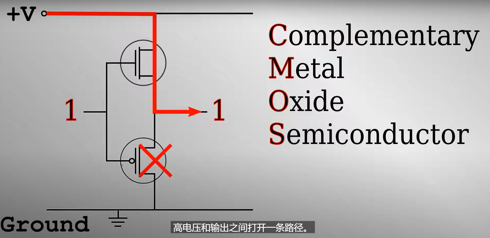
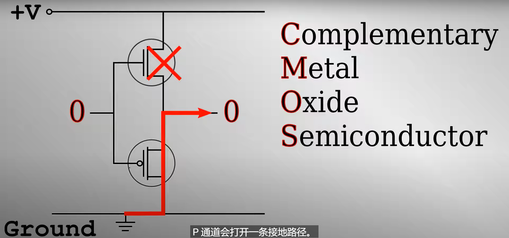

# 长断食后吃什么
清蒸蔬菜，发酵蔬菜，骨汤发酵牛奶，蛋，但是吃少量，不能喝苹果醋，因为是酸性，酮也是酸的，
可以将1/4茶匙小苏打兑水喝，不能过量运动，断食后不能立即吃碳水，会转化为脂肪细胞，此时的干细胞在增生，应该让它转化为有用的细胞，还会流失电解质，

# CPU 如何运行

# 什么是SDK和API
SDK（Software Development Kit）和 API（Application Programming Interface）都是用于帮助开发者创建应用程序的工具。

- SDK 是一套完整的开发工具集，它包含了一系列用于开发特定软件包、软件框架、硬件平台、操作系统等的工具。SDK 可能包含 API、编程工具（如编译器、调试器）、文档和示例代码等。

- API 是一套预定义的规则和规范，允许一个软件应用（或组件）与另一个软件应用（或组件）进行交互。API 可以定义函数、类、变量、数据结构等，开发者可以使用这些预定义的元素来访问和使用特定的软件应用或服务。

例如，如果你正在开发一个需要使用地图的应用，你可能会使用 Google Maps 的 API 来获取和显示地图数据，而 Google Maps 的 SDK 可能会提供一些工具和库，帮助你更容易地在你的应用中集成和使用这个 API。