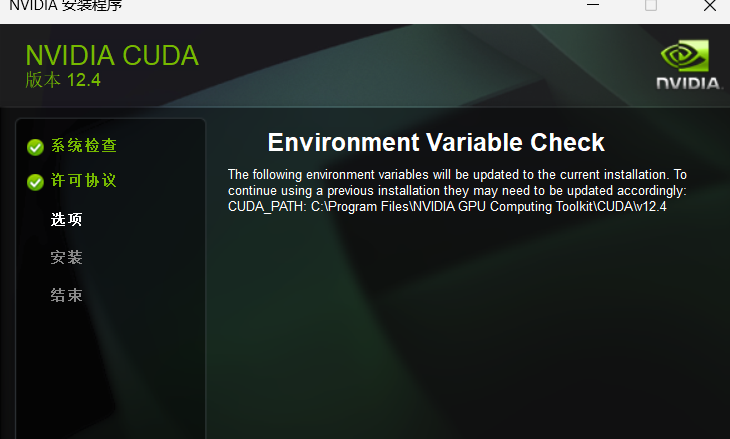

hash cat破解哈希值
john 获取hash值
D:\IDM下载\压缩文件\john-1.9.0-jumbo-1-win64\john-1.9.0-jumbo-1-win64\run>rar2john.exe huibian.rar
huibian.rar:$rar5$16$72e3b34113270c4852d4fb1d99b2e372$15$04f3497d6432c26c4699b84e6b9f06d1$8$43c56e3242864987
huibian.rar:$rar5$16$72e3b34113270c4852d4fb1d99b2e372$15$6bf5e95383769180598a8fc63c30c540$8$43c56e3242864987
huibian.rar:$rar5$16$72e3b34113270c4852d4fb1d99b2e372$15$97709abda43259de04c4379c9bc4a757$8$43c56e3242864987
huibian.rar:$rar5$16$72e3b34113270c4852d4fb1d99b2e372$15$5d38ac4c68d36895d56edadbbb09df9d$8$43c56e3242864987
huibian.rar:$rar5$16$72e3b34113270c4852d4fb1d99b2e372$15$b2024d256d0961536d5d8575da20ce6f$8$43c56e3242864987
huibian.rar:$rar5$16$72e3b34113270c4852d4fb1d99b2e372$15$9be5511882dbbe5e53b74588ba91668c$8$43c56e3242864987
huibian.rar:$rar5$16$72e3b34113270c4852d4fb1d99b2e372$15$4e95750637c2d1f665233e70e5818f17$8$43c56e3242864987
huibian.rar:$rar5$16$72e3b34113270c4852d4fb1d99b2e372$15$4b8c2b7a2b18ef346cbfaefa8809c33c$8$43c56e3242864987
huibian.rar:$rar5$16$72e3b34113270c4852d4fb1d99b2e372$15$8ee03a200fa88cf373abe09a74d0c953$8$43c56e3242864987
huibian.rar:$rar5$16$72e3b34113270c4852d4fb1d99b2e372$15$1db6b276fb5767e268f15f3699ed91a5$8$43c56e3242864987
huibian.rar:$rar5$16$72e3b34113270c4852d4fb1d99b2e372$15$dd258eb45976abe6dfc4a991e8a490fd$8$43c56e3242864987
huibian.rar:$rar5$16$72e3b34113270c4852d4fb1d99b2e372$15$78d2fba9032e9efb20a5278f4146ffdd$8$43c56e3242864987
huibian.rar:$rar5$16$72e3b34113270c4852d4fb1d99b2e372$15$bea280590b502089f8b493bcb432ba4b$8$43c56e3242864987
huibian.rar:$rar5$16$72e3b34113270c4852d4fb1d99b2e372$15$f63a69e03a46a31d251120f316b8e5c2$8$43c56e3242864987
huibian.rar:$rar5$16$72e3b34113270c4852d4fb1d99b2e372$15$bd9e9d5878dbf683bfc28ab25ec898c4$8$43c56e3242864987
huibian.rar:$rar5$16$72e3b34113270c4852d4fb1d99b2e372$15$f96b01055f1ba03d468a89a9f569f5fb$8$43c56e3242864987
huibian.rar:$rar5$16$72e3b34113270c4852d4fb1d99b2e372$15$52eac8f3d3227843e128888ca440a015$8$43c56e3242864987
huibian.rar:$rar5$16$72e3b34113270c4852d4fb1d99b2e372$15$6345c267d3c06d387ff9772d24b08c7b$8$43c56e3242864987
huibian.rar:$rar5$16$72e3b34113270c4852d4fb1d99b2e372$15$4af6fb5d13994d0fe52e563622500a0f$8$43c56e3242864987
huibian.rar:$rar5$16$72e3b34113270c4852d4fb1d99b2e372$15$1162ca65540cd27eca494b88de078748$8$43c56e3242864987
huibian.rar:$rar5$16$72e3b34113270c4852d4fb1d99b2e372$15$7f1660ffdbcdc301c77378396af5e9b6$8$43c56e3242864987
huibian.rar:$rar5$16$72e3b34113270c4852d4fb1d99b2e372$15$50003e3ca1d23147972db5657321b535$8$43c56e3242864987
huibian.rar:$rar5$16$72e3b34113270c4852d4fb1d99b2e372$15$c2f6a695dadbce88d810e03524266868$8$43c56e3242864987
huibian.rar:$rar5$16$72e3b34113270c4852d4fb1d99b2e372$15$f3ed04bee62f4df1131e61d2f0a6e22a$8$43c56e3242864987

使用hashcat破解

D:\IDM下载\压缩文件\hashcat-6.2.6\hashcat-6.2.6>hashcat.exe -m 13000 -w 4 -a 3 rar:$rar5$16$72e3b34113270c4852d4fb1d99b2e372$15$f3ed04bee62f4df1131e61d2f0a6e22a$8$43c56e3242864987 -o password.txt
hashcat (v6.2.6) starting


# 哈希加密原理
哈希加密是一种将任意长度的输入（也称为消息）转换为固定长度的输出的加密方法，其输出被称为哈希值。这种转换是一种单向函数，也就是说，给定一个输入，你可以很容易地计算出其哈希值，但是给定一个哈希值，你不能（或者说非常难）找出原始的输入。

以下是哈希加密的一些关键特性：

1. **确定性**：对于同一个输入，无论执行多少次哈希操作，得到的哈希值总是相同的。

2. **快速计算**：对任何给定的输入，计算其哈希值的速度都非常快。

3. **雪崩效应**：如果输入的信息发生微小的改变，那么哈希函数将产生截然不同的输出。换句话说，两个相似的输入将产生完全不同的哈希值。

4. **抗碰撞**：找到两个不同的输入，使得它们的哈希值相同，是非常困难的。

哈希加密在许多领域都有应用，包括密码学、数据完整性验证、数据检索等。例如，当你在网站上创建账户时，网站通常会存储你密码的哈希值，而不是密码本身。当你登录时，网站会计算你输入的密码的哈希值，然后将其与存储的哈希值进行比较。这样，即使数据库被泄露，攻击者也无法直接获取到用户的密码。

这是一个用于密码破解的 RAR5 哈希值，它的格式如下：

`huibian.rar:$rar5$16$72e3b34113270c4852d4fb1d99b2e372$15$f3ed04bee62f4df1131e61d2f0a6e22a$8$43c56e3242864987`

这个哈希值的各个部分的含义如下：

- `huibian.rar`：这是原始的 RAR 文件名。
- `$rar5$`：这表示这是一个 RAR5 格式的文件。
- `16`：这是盐值（salt）的长度。盐值是一个随机值，用于增加密码破解的难度。
- `72e3b34113270c4852d4fb1d99b2e372`：这是盐值。它是一个随机生成的值，用于与密码一起哈希，以防止预计算的哈希攻击。
- `15`：这是加密的数据的长度。
- `f3ed04bee62f4df1131e61d2f0a6e22a`：这是加密的数据。在这种情况下，它可能是文件的一部分，或者是一个特殊的值，用于验证密码。
- `8`：这是校验和的长度。
- `43c56e3242864987`：这是校验和。它是用于验证整个哈希值的完整性的。

这个哈希值可以用于密码破解工具，如 John the Ripper 或 hashcat，来尝试破解 RAR 文件的密码。


这是 hashcat 工具在初始化和运行时的输出信息。以下是各部分的解释：

- `Successfully initialized the NVIDIA main driver CUDA runtime library.`：成功初始化了 NVIDIA 的 CUDA 运行时库。CUDA 是 NVIDIA 的并行计算平台和 API，允许软件利用 NVIDIA 的 GPU 进行计算。

- `Failed to initialize NVIDIA RTC library.`：无法初始化 NVIDIA 的 RTC 库。这可能是因为你的系统中没有正确安装这个库。

- `Device #1: CUDA SDK Toolkit not installed or incorrectly installed.`：CUDA SDK Toolkit 没有安装或安装不正确。这个工具包是用于开发 CUDA 应用的。

- `Falling back to OpenCL runtime.`：由于无法使用 CUDA，hashcat 将使用 OpenCL 运行时。OpenCL 是一个开放的并行计算平台，可以用于各种类型的硬件。

- `Device #1: WARNING! Kernel exec timeout is not disabled.`：警告，内核执行超时没有被禁用。这可能会导致 "CL_OUT_OF_RESOURCES" 或相关错误。

- `nvmlDeviceGetFanSpeed(): Not Supported`：无法获取设备的风扇速度。这可能是因为你的设备不支持这个功能。

- `OpenCL API (OpenCL 3.0 CUDA 12.4.131) - Platform #1 [NVIDIA Corporation]`：显示了你的 NVIDIA 设备的 OpenCL 版本和其他信息。

- `OpenCL API (OpenCL 3.0 ) - Platform #2 [Intel(R) Corporation]`：显示了你的 Intel 设备的 OpenCL 版本和其他信息。

- `Minimum password length supported by kernel: 0` 和 `Maximum password length supported by kernel: 256`：内核支持的密码长度范围。

- `Hashes: 1 digests; 1 unique digests, 1 unique salts`：hashcat 将尝试破解的哈希数量和种类。

- `Watchdog: Temperature abort trigger set to 90c`：如果设备的温度达到 90 摄氏度，hashcat 将自动停止。

- `Host memory required for this attack: 1844 MB`：进行这次攻击需要的主机内存量。

这个输出告诉你 hashcat 的运行状态和配置，以及它将如何尝试破解密码。

`nvcc` 是 NVIDIA CUDA Compiler 的缩写。这是 NVIDIA 提供的一个用于编译 CUDA 代码的编译器。它可以将 CUDA 代码编译成可以在 NVIDIA 的图形处理单元（GPU）上运行的二进制代码。

当你编写 CUDA 程序时，你的代码通常会包含两部分：一部分是在 CPU 上运行的主机代码，另一部分是在 GPU 上运行的设备代码。`nvcc` 编译器的工作就是将这两部分代码分别编译成可以在相应硬件上运行的代码。

例如，你可以使用以下命令来使用 `nvcc` 编译一个名为 `add.cu` 的 CUDA 程序：

```bash
nvcc add.cu -o add
```

在这个命令中，`add.cu` 是源代码文件，`-o add` 指定了输出的可执行文件的名称。执行这个命令后，你就可以运行 `add` 程序了。



