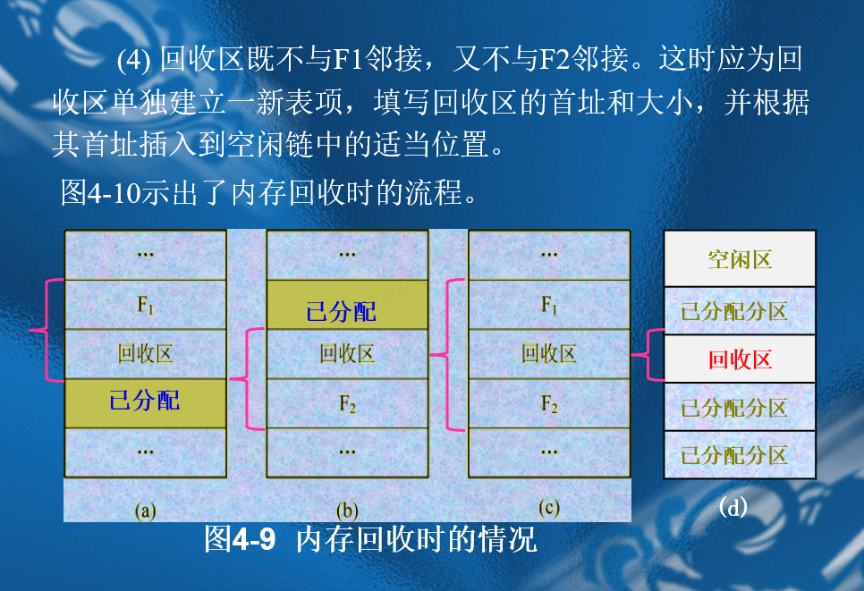

# 第四章存储器管理
## 4.1  存储器的层次结构
时钟周期，也被称为时钟脉冲或时钟周期，是计算机处理器执行操作的基本时间单位。它是由计算机的系统时钟产生的，用于同步计算机内部的各种操作。

时钟周期的长度由计算机的时钟速度决定，通常用赫兹（Hz）来表示。例如，一个 3 GHz 的处理器每秒可以产生 3,000,000,000 个时钟周期。

举例来说，假设一个处理器的时钟速度是 2 GHz，那么每个时钟周期的长度就是 0.5 纳秒（1/2,000,000,000 秒）。如果一个指令需要 3 个时钟周期才能完成，那么这个指令的执行时间就是 1.5 纳秒（3 * 0.5 纳秒）。

需要注意的是，不同的指令可能需要不同数量的时钟周期才能完成，这取决于指令的复杂性和处理器的设计。此外，现代处理器通常可以在一个时钟周期内执行多条指令，这被称为超标量执行。

你的描述是正确的。绝对装入方式是一种简单的程序装入方式，适用于小型操作系统和单道程序环境。

在绝对装入方式中，编译器在编译程序时就已经确定了程序在内存中的绝对地址。这意味着程序必须在编译时就知道它将在内存中的哪个位置运行。因此，编译后的程序（也就是目标代码）包含了绝对地址，不需要链接就可以直接装入内存。

装入程序（也就是加载器）只需要按照目标代码中的地址，将程序和数据装入内存即可。因为程序中的逻辑地址（也就是程序中使用的地址）和内存地址（也就是程序实际在内存中的地址）是相同的，所以不需要进行地址置换。

然而，绝对装入方式的缺点是灵活性较差。因为程序的地址在编译时就已经确定，所以如果需要将程序装入到内存的其他位置，就需要重新编译程序。此外，这种方式也不支持多道程序环境，因为每个程序都需要在编译时就确定其在内存中的位置。

你的描述是正确的。在多道程序环境下，由于有多个程序需要在内存中运行，编译器无法预知每个程序应该被装入到内存的哪个位置。因此，需要对编译后的目标模块进行重新编址，这就是所谓的重定位。

在可重定位装入方式中，程序的地址是相对地址，也就是说，它们是相对于程序的起始地址计算的。装入程序（加载器）需要将这些相对地址映射（或重定位）为绝对地址，也就是程序实际在内存中的地址。这样，程序就可以被装入到内存的任何可用位置。

这种重定位是在装入时完成的，因此也被称为静态重定位。静态重定位的优点是它只需要在装入时进行一次，而不需要在程序运行时进行。然而，它的缺点是一旦程序被装入到内存，它的位置就不能再改变，除非重新装入。

你的描述是正确的。静态重定位的缺点是一旦程序被装入到内存，它的位置就不能再改变，除非重新装入。这是因为程序的绝对地址在装入时已经确定，如果在程序运行过程中移动程序的位置，那么程序和数据的绝对地址就会发生变化。

为了解决这个问题，可以使用动态运行时装入方式。在这种装入方式中，程序和数据被装入内存后，并不立即进行地址转换。相反，地址转换是在程序运行时进行的。这意味着程序可以在内存中移动位置，因为每次程序访问内存时，都会进行地址转换。

动态运行时装入方式的优点是它提供了更大的灵活性，因为程序可以在运行时移动位置。然而，它的缺点是它需要在程序运行时进行地址转换，这会增加 CPU 的负担。此外，这种方式也需要操作系统支持动态地址转换，这通常需要硬件的支持，例如内存管理单元（MMU）。

## 4.2程序的链接
你的描述是正确的。静态链接是一种在程序运行之前将各个目标模块和它们所需的库函数链接成一个完整的装入模块的方式。这个过程通常由链接器（Linker）完成。

在静态链接过程中，需要解决两个主要问题：

1. 对相对地址进行修改：由于每个目标模块在编译时都是独立编译的，它们的地址是相对于各自模块的起始地址的。在链接时，需要将这些相对地址修改为相对于整个装入模块的起始地址的地址。

2. 变换外部调用符号：在一个模块中可能会调用其他模块中的函数或变量，这些函数或变量在当前模块中是未定义的，被称为外部符号。在链接时，需要将这些外部符号解析为它们在整个装入模块中的实际地址。

静态链接的优点是它生成的装入模块是完整的，可以直接装入内存运行，不需要在运行时进行链接。然而，它的缺点是它生成的装入模块通常比较大，因为它包含了所有的目标模块和库函数。此外，如果一个库函数发生了改变，那么使用这个库函数的所有程序都需要重新链接。

你的描述是正确的。装入时动态链接是一种在程序装入内存时进行链接的方式。在这种方式中，当装入一个目标模块时，如果发生一个外部模块调用事件，那么装入程序就找出相应的外部目标模块，并将它链接后装入内存，并修改目标模块中的相对地址。

装入时动态链接方式有以下优点：

1. 便于修改和更新：由于各目标模块是分开存放的，所以要修改或更新各目标模块是件非常容易的事。对于经静态链接装配在一起的装入模块，如果要修改或更新其中的某个目标模块，则要求重新打开装入模块。这不仅低效，而且有时是不可能的。

2. 便于实现对目标模块的共享：在采用静态链接方式时，每个应用模块都必须含有其目标模块的拷贝，无法实现对目标模块的共享。但采用装入时动态链接方式，操作系统则很容易将一个目标模块链接到几个应用模块上，实现多个应用程序对该模块的共享。

然而，装入时动态链接方式也有其缺点，例如它需要在程序装入内存时进行链接，这会增加装入时间。此外，如果一个目标模块被多个应用程序共享，那么当这个目标模块发生改变时，所有使用这个目标模块的应用程序都可能需要重新装入。

好的，我来举个例子来解释这个概念。

假设我们有两个应用程序，应用程序A和应用程序B，它们都需要使用一个名为“libMath”的数学库函数。这个库包含了一些常用的数学函数，比如求平方根、求对数等。

如果我们采用静态链接方式，那么在链接应用程序A和应用程序B时，我们需要将“libMath”库的所有函数都链接到这两个应用程序中。这样，应用程序A和应用程序B都会有一份“libMath”库的拷贝。这就意味着，我们在内存中有两份“libMath”库的拷贝，这是一种浪费。

但是，如果我们采用装入时动态链接方式，那么我们只需要在内存中保留一份“libMath”库的拷贝。当应用程序A或应用程序B需要使用“libMath”库的函数时，操作系统会将这个库链接到应用程序A或应用程序B上。这样，应用程序A和应用程序B都可以共享同一份“libMath”库的拷贝，这就节省了内存空间。

这就是装入时动态链接方式可以实现对目标模块的共享的原因。

你的问题指出了装入时动态链接方式的一个缺点，那就是可能会将一些实际上并不需要的模块也装入到内存中。这确实可能导致内存的浪费。

为了解决这个问题，我们可以使用运行时动态链接（也称为延迟链接）的方式。在这种方式中，我们只在真正需要使用某个模块时才将它装入内存并进行链接。

例如，假设我们有一个应用程序，它有一个模块是用来处理错误的。在程序运行的过程中，只有当发生错误时，我们才需要使用这个模块。如果我们采用运行时动态链接的方式，那么在程序开始运行时，我们并不会将这个错误处理模块装入内存。只有当真正发生错误时，我们才会将这个模块装入内存并进行链接。

这种方式可以有效地节省内存空间，因为我们只需要将真正需要的模块装入内存。然而，它也有一个缺点，那就是它可能会增加程序运行时的延迟，因为我们需要在程序运行时进行链接。

你的描述是正确的。运行时动态链接（也称为延迟链接）的方式是在程序执行过程中，当发现一个被调用模块尚未装入内存时，立即由操作系统找到该模块并将其装入内存，并把它链接到调用者模块上。

这种方式有以下优点：

1. 加快程序的装入过程：由于我们只在需要的时候才装入和链接模块，所以我们可以减少程序装入时的工作量，从而加快程序的装入过程。

2. 节省内存空间：由于我们只装入和链接真正需要的模块，所以我们可以节省大量的内存空间。

然而，运行时动态链接方式也有一个缺点，那就是它可能会增加程序运行时的延迟，因为我们需要在程序运行时进行链接。

## 4.3连续分配存储管理方式
你的描述是正确的。单一连续分配是一种简单的内存管理方式，主要用于单道程序环境。在这种方式中，内存被分为两部分：系统区和用户区。

系统区是为操作系统(OS)保留的，通常位于内存的低地址部分。操作系统在这个区域中运行，管理硬件资源，提供各种服务。

用户区是为用户程序保留的。在单道程序环境下，用户区中只有一道用户程序，即整个内存的用户空间由该程序独占。这就意味着，一次只能运行一个程序，其他程序必须等待当前程序运行完毕后才能运行。

这种方式的优点是简单，易于管理。但是，它的缺点也很明显，那就是无法同时运行多个程序，且可能会造成内存的浪费，因为当前程序可能并不需要使用所有的用户空间。

你的描述是正确的。在早期的单用户、单任务操作系统中，如CP/M、MS-DOS及RT11等，通常没有采取存储器保护措施。这主要有两个原因：

1. 节省硬件：存储器保护机构需要额外的硬件支持，如果不采取存储器保护措施，可以节省这部分硬件成本。

2. 单用户环境下的安全性：在单用户环境下，机器由一用户独占，不可能存在其他用户干扰的问题。因此，即使用户程序破坏了操作系统，其影响也只限于该用户程序，不会影响到其他用户。

当然，这并不意味着这种方式没有问题。如果用户程序破坏了操作系统，可能需要重新启动系统并重新装入操作系统，这会影响到用户的使用体验。但是，在早期的计算机系统中，这种问题的影响通常是可以接受的。

你的描述是正确的。在多道操作系统中，为了保证多道程序之间不能相互干扰，需要将整个用户空间划分成多个程序空间或分区，每个分区装入一道程序。这种方式通常被称为固定分区分配。

固定分区分配有两种主要的方式：

1. 各分区大小相等：这种方式的优点是简单，但缺点是缺乏灵活性。当程序太小时，会造成内存空间的浪费；当程序太大时，一个分区又装不下，程序无法运行。

2. 各分区大小不等：为了增加存储分配的灵活性，可以把用户空间划分成若干个大小不等的分区。这样，就可以为不同大小的程序，分配不同大小的分区。

在进行内存分配时，操作系统通常会维护一张分区使用表，记录每个分区的起始地址、大小和状态。当需要内存分配时，操作系统会检索这张表，找出一个能满足大小要求且尚未分配的分区，然后分配给请求程序，并将该分区的状态置为“已分配”。如果找不到大小足够的分区，操作系统会拒绝为该请求分配内存。

在多道操作系统中，进行分区的主要原因是为了实现内存的隔离，保证多道程序之间不能相互干扰。

如果不进行分区，所有的程序都会在同一块内存空间中运行，这就可能导致一个程序修改了另一个程序的数据，或者一个程序崩溃导致整个系统崩溃的问题。

通过将内存划分为多个分区，每个程序都在自己的分区中运行，这样就可以避免这些问题。每个分区都有自己的起始地址和大小，程序只能在自己的分区中运行，不能访问其他分区的内存，这样就实现了内存的隔离。

此外，进行分区还可以提高内存的利用率。通过将内存划分为不同大小的分区，可以根据程序的大小，为其分配合适大小的分区，避免了内存的浪费。

好的，让我们通过一个例子来说明内存分区的工作方式。

假设我们有一个内存大小为1000KB的系统，我们将其划分为三个分区，分别为300KB、400KB和300KB。

现在，有三个程序需要运行，它们的大小分别为200KB、350KB和250KB。

1. 对于第一个程序，它的大小是200KB，可以放入第一个分区（300KB）。分配后，第一个分区还剩下100KB的空间。

2. 对于第二个程序，它的大小是350KB，不能放入第一个分区（只剩下100KB），但可以放入第二个分区（400KB）。分配后，第二个分区还剩下50KB的空间。

3. 对于第三个程序，它的大小是250KB，不能放入第一个分区（只剩下100KB）和第二个分区（只剩下50KB），但可以放入第三个分区（300KB）。分配后，第三个分区还剩下50KB的空间。

通过这种方式，我们可以看到，每个程序都在自己的分区中运行，不能访问其他分区的内存，实现了内存的隔离。同时，通过合理的分区，我们也避免了内存的浪费。

如果不进行内存分区，所有的程序都会在同一块内存空间中运行，这可能会导致一些问题。让我们通过一个例子来说明。

假设我们有一个内存大小为1000KB的系统，现在有两个程序需要运行，它们的大小分别为500KB和600KB。

1. 对于第一个程序，它的大小是500KB，可以放入内存中。此时，内存还剩下500KB的空间。

2. 对于第二个程序，它的大小是600KB，也可以放入内存中。但是，由于内存没有进行分区，第二个程序可能会覆盖第一个程序的数据，导致第一个程序运行出错。

此外，如果第二个程序在运行过程中出现了错误，可能会影响到整个系统的稳定性，因为所有的程序都在同一块内存空间中运行。

通过这个例子，我们可以看到，如果不进行内存分区，可能会导致程序之间相互干扰，影响系统的稳定性。同时，也可能会导致内存的浪费，因为没有进行合理的内存分配。

### 动态分区分配/可变分区分配
你的描述是正确的。在动态分区分配中，系统会根据进程的实际需要动态地分配存储空间。这种方式需要维护一些数据结构来描述空闲分区和已分配分区的情况。

常用的数据结构有以下两种：

1. 空闲分区表：系统中设置一张空闲分区表，用于记录每个空闲分区的情况。每个表项记录一个空闲分区的情况，包括分区号、分区大小、分区始址和状态等数据项。

2. 空闲分区链：系统中设置一张空闲分区链表，将每个空闲分区链接起来。在每个分区的起始部分，设置了链接各分区的前向指针和分区的一些分配信息；在分区的尾部，设置了后向指针和分区的一些分配信息。当分区被分配出去后，把状态位由“0”改为“1”，此时，前、后向指针已无意义。

这两种数据结构都可以帮助操作系统有效地管理内存，实现动态分区分配。

好的，让我们通过一个例子来说明这个过程。

假设我们有一个空闲分区链表，其中有三个空闲分区，分别为A、B和C。每个分区的状态位都是“0”，表示它们都是空闲的。每个分区的前向指针和后向指针分别指向前一个分区和后一个分区。

现在，有一个进程需要分配一个分区，我们选择分区B进行分配。分配后，我们将分区B的状态位由“0”改为“1”，表示它已经被分配出去。此时，分区B的前向指针和后向指针已经没有意义，因为它已经不再是空闲分区，不需要再被链接在空闲分区链表中。

同时，我们需要更新分区A和分区C的前向指针和后向指针。分区A的后向指针需要指向分区C，分区C的前向指针需要指向分区A。这样，我们就将分区B从空闲分区链表中移除，完成了分区的分配。

通过这个例子，我们可以看到，当分区被分配出去后，其状态位会被改为“1”，前向指针和后向指针就没有意义了，因为它已经不再是空闲分区，不需要再被链接在空闲分区链表中。

### 分配回收
你的描述是正确的。在动态分区存储管理中，主要的操作包括分配内存/分区和回收内存/分区。

1. 分配内存过程：系统根据分配算法和所需分区的大小，从空闲分区表/链中查找，将找到的分区分配给作业。这个过程可能会产生一些问题，比如有些分区太小，难以分配出去。但如果不分配，就会造成内存的浪费。这些无法使用的小分区被称为碎片，因为它们是在分区之外的，所以也被称为外部碎片。

2. 回收内存过程：当一个作业完成后，系统需要回收它所占用的分区，将其重新加入到空闲分区表/链中，以供其他作业使用。

在这个过程中，作业请求的分区大小为u.size，空闲分区表中空闲分区的大小为m.size。系统需要找到一个m.size大于或等于u.size的分区进行分配。

好的，让我们通过一个例子来说明这个过程。

假设我们有一个空闲分区表，其中有三个空闲分区，分别为A、B和C。它们的大小分别为100KB、200KB和300KB，即m.size为100KB、200KB和300KB。

现在，有一个作业需要分配一个大小为150KB的分区，即u.size为150KB。

系统会从空闲分区表中查找一个大小大于或等于150KB的分区进行分配。首先，系统会查看分区A，发现它的大小只有100KB，小于150KB，所以不能分配给这个作业。然后，系统会查看分区B，发现它的大小是200KB，大于150KB，所以可以分配给这个作业。

分配后，分区B的大小会减少150KB，变为50KB。系统会更新空闲分区表，将分区B的大小改为50KB。

通过这个例子，我们可以看到，系统会根据作业请求的分区大小u.size，从空闲分区表中找到一个大小大于或等于u.size的分区进行分配。

内存回收的几种情况

### 4.3.4  基于顺序搜索的动态分区分配算法
你的描述是正确的。首次适应（First Fit，FF）算法是一种基于顺序搜索的动态分区分配算法。它的工作过程如下：

1. 空闲分区链以地址递增的次序链接。在分配内存时，从链首开始顺序查找，直至找到一个大小能满足要求的空闲分区为止。

2. 找到满足要求的空闲分区后，再按照作业的大小，重新划分分区。原来的一个分区变为两个分区，其中一个分区分配给作业，另一个分区仍留在空闲链中。

3. 如果找不到满足要求的空闲分区，那么内存分配失败，返回。

首次适应算法的优点是：因为优先分配低地址空间，所以使得高地址空间较少被划分，留下的分区较大，对大小作业都公平。

首次适应算法的缺点是：低地址部分碎片多，查找CPU开销大。

好的，让我们通过一个例子来说明首次适应（First Fit，FF）算法的工作过程。

假设我们有一个空闲分区链，其中有三个空闲分区，分别为A、B和C。它们的大小分别为100KB、200KB和300KB，且按照地址递增的次序链接。

现在，有一个作业需要分配一个大小为150KB的分区。

首次适应算法会从链首开始顺序查找，直至找到一个大小能满足要求的空闲分区为止。首先，它会查看分区A，发现它的大小只有100KB，小于150KB，所以不能分配给这个作业。然后，它会查看分区B，发现它的大小是200KB，大于150KB，所以可以分配给这个作业。

找到满足要求的空闲分区后，系统会按照作业的大小，重新划分分区B。原来的一个分区变为两个分区，其中一个分区（假设大小为150KB）分配给作业，另一个分区（假设大小为50KB）仍留在空闲链中。

如果此时有另一个作业需要分配一个大小为250KB的分区，那么系统会继续从链首开始顺序查找，但是无法找到一个大小能满足要求的空闲分区，因此内存分配失败，返回。

通过这个例子，我们可以看到首次适应算法的工作过程和优缺点。

你的描述是正确的。循环首次适应（Next Fit，NF）算法是为了解决首次适应算法中低地址部分留下许多碎片，以及查找开销大的问题而提出的。

循环首次适应算法的工作过程如下：

1. 在为进程分配内存空间时，不再是每次都从链首开始查找，而是从上次找到的空闲分区的下一个空闲分区开始查找。

2. 直至找到一个能满足要求的空闲分区。

3. 找到满足要求的空闲分区后，再按照作业的大小，重新划分分区。原来的一个分区变为两个分区，其中一个分区分配给作业，另一个分区仍留在空闲链中。

技术上，这需要设置一个指针，指示下次查找的起始位置。并且，采用循环的查找方式。

循环首次适应算法的优点是：因为空闲分区分布均匀，所以减少了查找开销。

循环首次适应算法的缺点是：因为空闲分区分布均匀，所以减少了大分区，对大作业不公平。

好的，让我们通过一个例子来说明循环首次适应（Next Fit，NF）算法的工作过程。

假设我们有一个空闲分区链，其中有三个空闲分区，分别为A、B和C。它们的大小分别为100KB、200KB和300KB，且按照地址递增的次序链接。

现在，有一个作业需要分配一个大小为150KB的分区。

循环首次适应算法会从链首开始顺序查找，直至找到一个大小能满足要求的空闲分区为止。首先，它会查看分区A，发现它的大小只有100KB，小于150KB，所以不能分配给这个作业。然后，它会查看分区B，发现它的大小是200KB，大于150KB，所以可以分配给这个作业。

找到满足要求的空闲分区后，系统会按照作业的大小，重新划分分区B。原来的一个分区变为两个分区，其中一个分区（假设大小为150KB）分配给作业，另一个分区（假设大小为50KB）仍留在空闲链中。

如果此时有另一个作业需要分配一个大小为250KB的分区，那么系统不再从链首开始查找，而是从上次找到的空闲分区的下一个空闲分区（即分区C）开始查找。如果找到一个大小能满足要求的空闲分区，那么系统会按照作业的大小，重新划分分区。如果找不到，那么系统会从链首开始查找，直到找到满足要求的空闲分区为止。

通过这个例子，我们可以看到循环首次适应算法的工作过程和优缺点。

循环首次适应算法（Next Fit，NF）与首次适应算法（First Fit，FF）相比，有以下优势和劣势：

优势：
1. 减少了查找开销：因为循环首次适应算法从上次分配的空闲分区的下一个空闲分区开始查找，而不是每次都从链首开始，因此可以减少查找开销。

2. 空闲分区分布均匀：循环首次适应算法使得空闲分区在内存中的分布更加均匀，不会像首次适应算法那样在低地址部分留下许多小的空闲分区。

劣势：
1. 减少了大分区：因为空闲分区分布均匀，所以可能会减少大的连续空闲分区，对需要大量内存的作业不公平。

2. 可能会增加内存碎片：循环首次适应算法可能会在内存中留下更多的小的空闲分区，从而增加内存碎片。

3. 查找时间可能会增加：如果需要分配的内存大小较大，那么可能需要遍历整个空闲分区链才能找到满足要求的空闲分区，从而增加查找时间。

你的描述是正确的。最佳适应（Best Fit，BF）算法是为了避免“大材小用”而提出的。

最佳适应算法的工作过程如下：

1. 每次为作业分配内存时，总是把能满足大小要求，又是最小的空闲分区分配给作业。

2. 为了加快查找，算法要求将所有的空闲分区按其容量以从小到大的顺序形成一空闲分区链。这样，第一次找到的空闲分区，必然是最佳的。

最佳适应算法的优点是：对大小作业都比较公平。

最佳适应算法的缺点是：虽然最佳适应算法似乎是最佳的，然而在宏观上却不一定。因为每次分配后所切割下来的剩余部分总是最小的，这样，在存储器中会留下许多碎片。

选择最佳适应算法（Best Fit）还是循环首次适应算法（Next Fit）来处理内存分配，主要取决于具体的应用场景和需求。

最佳适应算法在处理小作业时表现较好，因为它总是选择最小的能满足需求的空闲分区，从而尽可能减少浪费。然而，这种算法可能会导致大量的内存碎片，因为它经常留下一些小的空闲分区。

相比之下，循环首次适应算法在处理大作业时可能表现更好，因为它不会优先使用小的空闲分区。此外，它的查找开销可能较小，因为它从上次分配的空闲分区的下一个空闲分区开始查找。然而，这种算法可能会导致大的空闲分区变得更少。

总的来说，没有一种算法是在所有情况下都最优的。选择哪种算法，需要根据具体的应用场景和需求来决定。

你的描述是正确的。最坏适应（Worst Fit，WF）算法是为了“大材小用”而提出的。

最坏适应算法的工作过程如下：

1. 每次为作业分配内存时，总是把最大的空闲分区分配给作业。

2. 为了加快查找，算法要求将所有的空闲分区按其容量由大到小的顺序形成一空闲分区链。这样，第一次找到的空闲分区，必然是最坏的。

最坏适应算法的优点是：可使剩下的空闲区不至于太小，产生碎片的几率最小，即存储效率高，且查找效率很高。对中、小作业有利。

最坏适应算法的缺点是：它会使存储器中缺乏大的空闲分区。对大作业更不利，尤其是与循环首次适应算法相比。

选择最佳适应算法（Best Fit）还是最坏适应算法（Worst Fit）来处理内存分配，主要取决于具体的应用场景和需求。

最佳适应算法在处理小作业时表现较好，因为它总是选择最小的能满足需求的空闲分区，从而尽可能减少浪费。然而，这种算法可能会导致大量的内存碎片，因为它经常留下一些小的空闲分区。

相比之下，最坏适应算法在处理大作业时可能表现更好，因为它总是选择最大的空闲分区。此外，它的查找开销可能较小，因为它从上次分配的空闲分区的下一个空闲分区开始查找。然而，这种算法可能会导致大的空闲分区变得更少。

总的来说，没有一种算法是在所有情况下都最优的。选择哪种算法，需要根据具体的应用场景和需求来决定。

好的，让我们通过一个例子来说明最佳适应（Best Fit）和最坏适应（Worst Fit）算法的过程。

假设我们有以下空闲内存块：100KB, 500KB, 200KB, 300KB, 600KB。现在有一个需要250KB的作业需要分配内存。

**最佳适应算法（Best Fit）：**

1. 首先，算法会查找所有空闲内存块，找到最小的但仍然能满足作业需求的内存块。在这个例子中，这个内存块是300KB。

2. 然后，算法会将这个内存块分配给作业，剩下的50KB会留作空闲。

3. 最后，空闲内存块列表变为：100KB, 500KB, 200KB, 50KB, 600KB。

**最坏适应算法（Worst Fit）：**

1. 首先，算法会查找所有空闲内存块，找到最大的内存块。在这个例子中，这个内存块是600KB。

2. 然后，算法会将这个内存块分配给作业，剩下的350KB会留作空闲。

3. 最后，空闲内存块列表变为：100KB, 500KB, 200KB, 300KB, 350KB。

这个例子清楚地展示了最佳适应和最坏适应算法的工作原理和区别。

