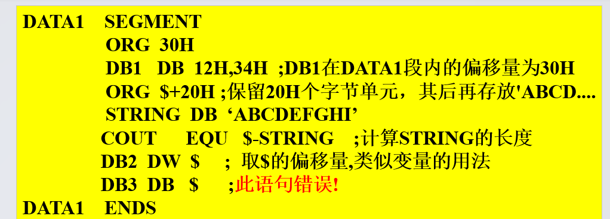
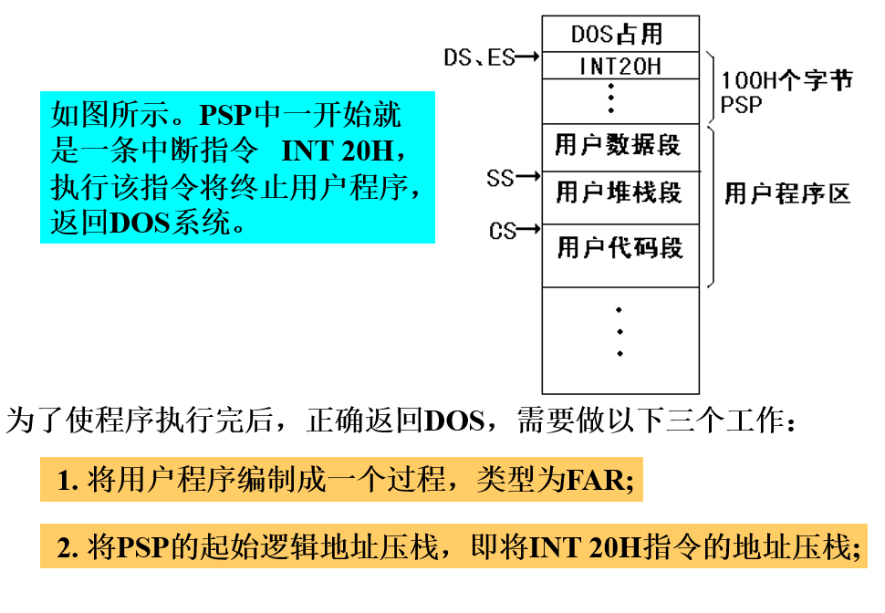

理解DOS原理
DOS，全称Disk Operating System，磁盘操作系统，是一种面向磁盘的、单用户的、单任务的命令行操作系统。DOS系统在1980年代和1990年代初期广泛使用，尤其是IBM PC和兼容机中的MS-DOS版本。

DOS系统提供了文件管理、设备管理、内存管理和进程管理等基本功能。用户通过键入命令行来操作系统，例如管理文件、运行程序等。

尽管现在的个人电脑大多使用图形用户界面的操作系统，如Windows、macOS和Linux，但DOS仍然在一些特定的环境和应用中使用，例如嵌入式系统和某些特定的工业控制应用。

在汇编语言中，你可以通过调用DOS中断（Interrupt）来使用DOS的功能。DOS中断是一种软件中断，可以让你的程序请求DOS执行某些操作，如读写文件、获取系统时间等。

以下是一个简单的例子，展示了如何在汇编语言中使用DOS中断来打印字符串：

```assembly
section .data
    message db 'Hello, DOS!', 0

section .text
    global _start

_start:
    ; 使用DOS的9号中断打印字符串
    mov ah, 0x09
    mov dx, message
    int 0x21

    ; 使用DOS的20号中断结束程序
    mov ah, 0x4c
    int 0x21
```

在这个例子中，我们首先将要打印的字符串存储在数据段中。然后，我们使用DOS的9号中断（`int 0x21`）来打印这个字符串。最后，我们使用DOS的20号中断（`int 0x21`）来结束程序。

需要注意的是，这个例子使用了16位实模式汇编语言，这是DOS操作系统使用的模式。现代的操作系统，如Windows、macOS和Linux，使用的是32位或64位保护模式，因此不能直接使用这种方式调用DOS中断。